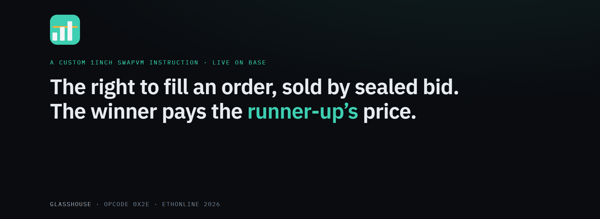
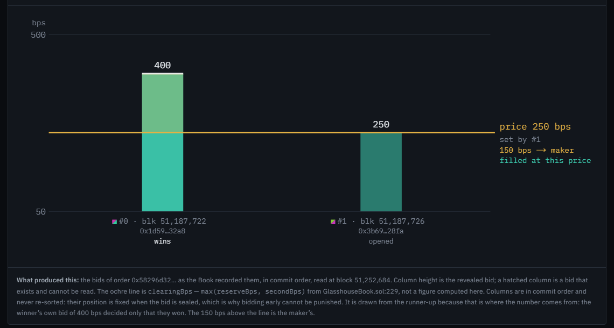
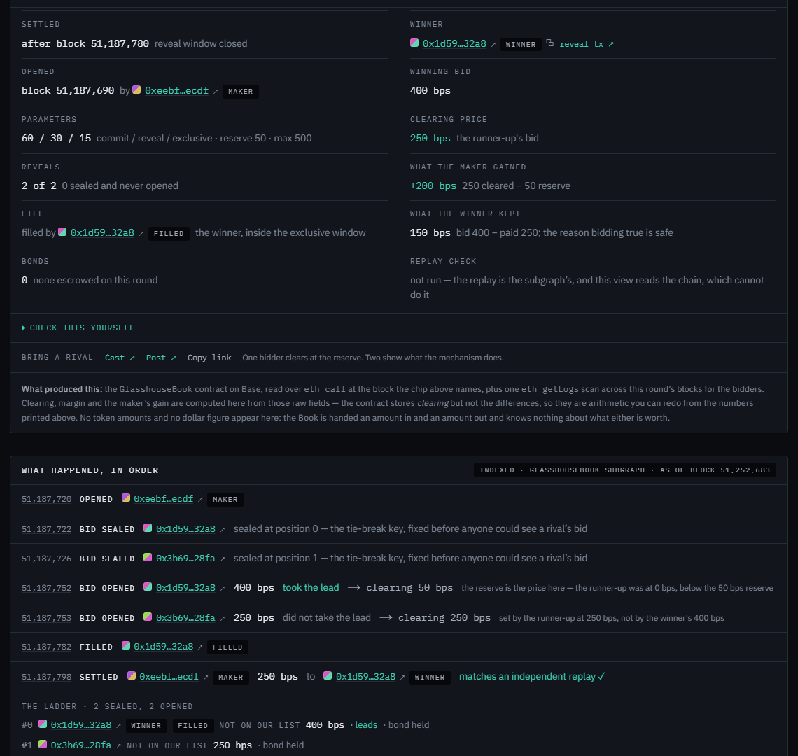
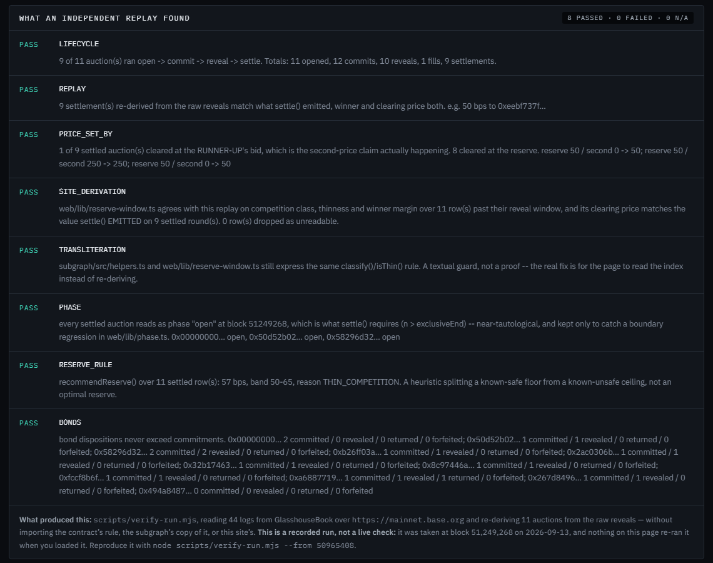
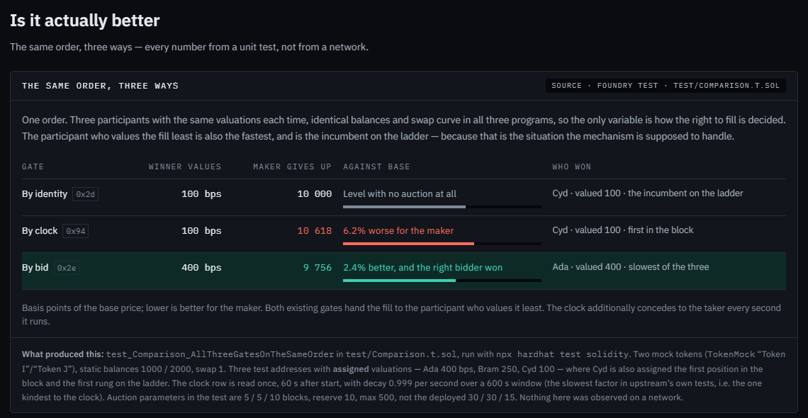
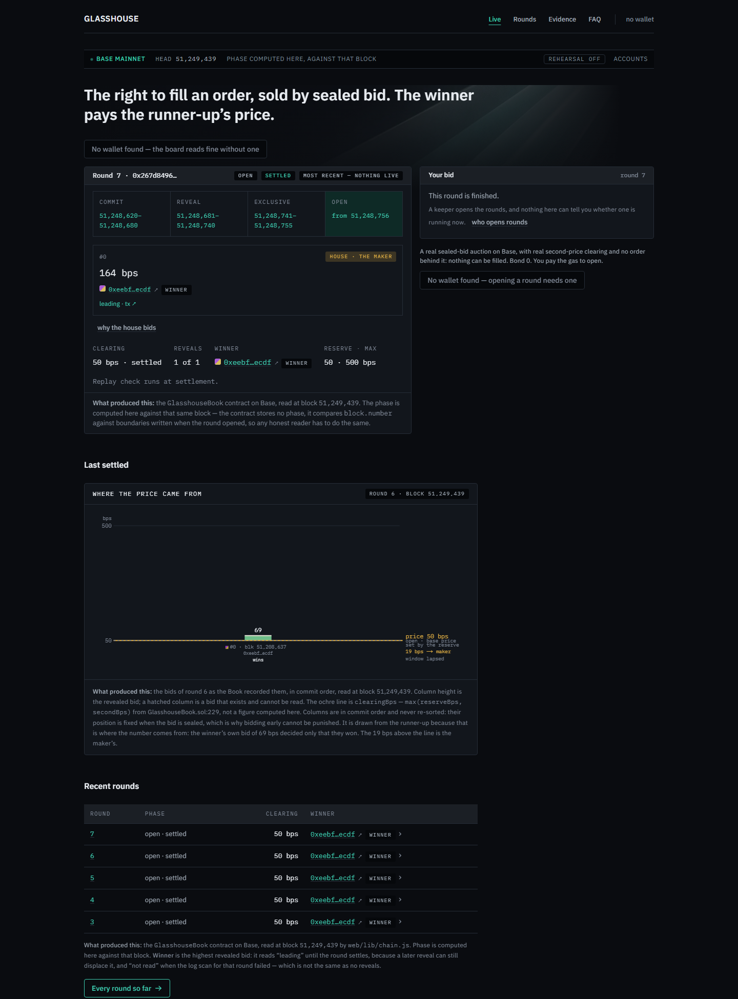
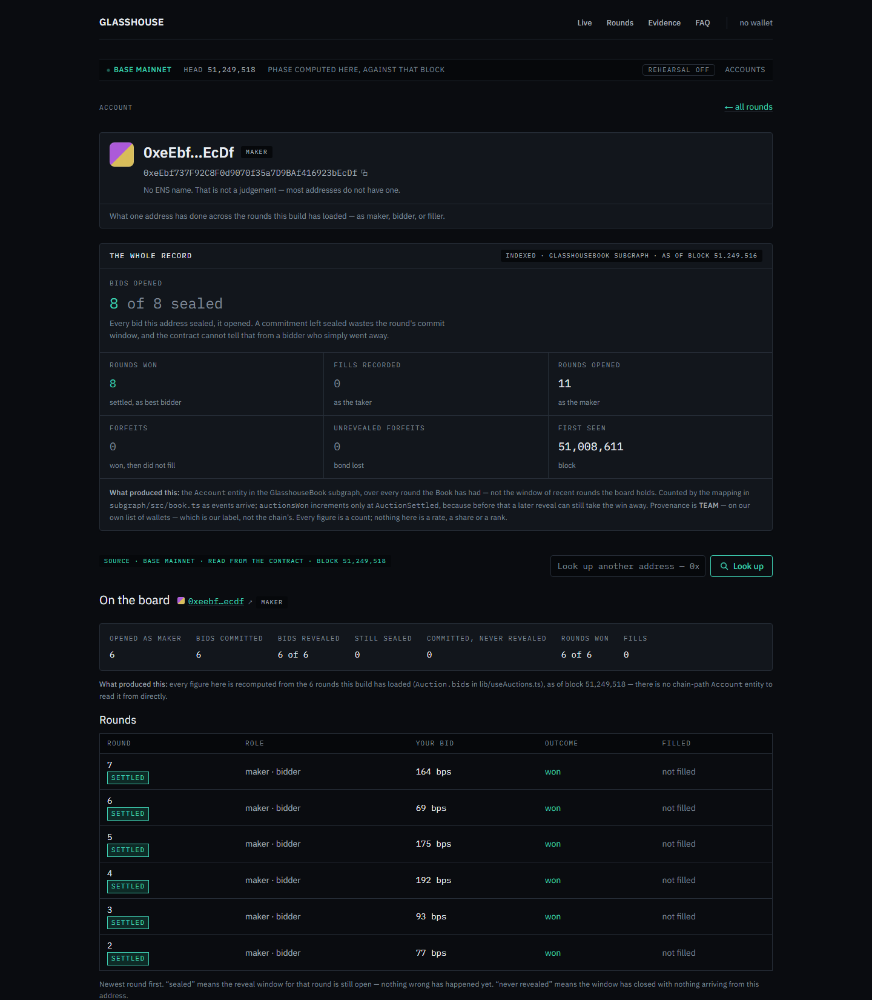

# Glasshouse

**Taker priority allocated by sealed competitive bid — not by identity, not by clock.**

A custom 1inch SwapVM instruction, opcode `0x2e`, live on Base mainnet. ETHOnline 2026.

| | |
|---|---|
| **Live site** | **[glasshouse-ashy.vercel.app](https://glasshouse-ashy.vercel.app)** — no wallet needed to read it |
| **Start here** | [`/evidence`](https://glasshouse-ashy.vercel.app/evidence) — the receipt, and an independent replay of every auction on the Book |
| **Network** | Base mainnet (chain 8453), deployed from block 50,965,408 |
| **`GlasshouseBook`** | [`0xc4ea91Fe700918220423ac307C6B1c59650FFbfe`](https://basescan.org/address/0xc4ea91Fe700918220423ac307C6B1c59650FFbfe) |
| **`GlasshouseRouter`** | [`0x5c3baE054e8b4915a13726B397b1AeA864247DBf`](https://basescan.org/address/0x5c3baE054e8b4915a13726B397b1AeA864247DBf) |
| **1inch Aqua (official)** | [`0x1111113CCf1426A8E30e2bfF5E005d929bF6a90a`](https://basescan.org/address/0x1111113CCf1426A8E30e2bfF5E005d929bF6a90a) |
| **Subgraph** | [`FPQdiZTAnR8ac6grgAF2x49bWqwDh87RzqUgQxAvoY2y`](https://thegraph.com/explorer/subgraphs/FPQdiZTAnR8ac6grgAF2x49bWqwDh87RzqUgQxAvoY2y) |
| **Repo** | [github.com/IIITManjeet/Glasshouse](https://github.com/IIITManjeet/Glasshouse) |

<p align="center">
  
</p>

---

## What it is, in 30 seconds

**The problem.** SwapVM ships two ways to decide *who may fill an order*, and neither asks what
the fill is worth.

- **By identity — `WhitelistSequential`, opcode `0x2d`.** A hardcoded ladder of privileged
  takers. An unlisted taker does not merely lose priority; it reverts until the whole ladder
  has elapsed.
- **By clock — `DutchAuctionBalanceIn`, opcode `0x94`.** The price is a pure function of
  `block.timestamp`. Every transaction in a block shares one timestamp, so every bidder in that
  block sees the same price. Allocation falls to intra-block ordering — priority fees and
  builder placement — and the surplus goes to the builder, not the maker.

**The mechanism.** Glasshouse adds a third gate, opcode `0x2e`: a **sealed-bid, second-price
auction** settled on chain.

1. Bidders **commit** a hash of their bid.
2. In the reveal window they **reveal** it.
3. The highest bid wins and pays **`max(reserveBps, secondBps)`** — the runner-up's price, so
   bidding your true value is safe ([`src/book/GlasshouseBook.sol:229`](./src/book/GlasshouseBook.sol)).
4. The winner gets an **exclusive fill window**; afterwards the order opens at base price to
   anyone.

The bid is a price improvement in basis points applied to `balanceIn`, so ordinary SwapVM
settlement delivers the surplus to the maker — no transfer, no custody, no fee router.
`GlasshouseBook` has **no owner, no admin and no upgrade path**.

**The one number.** One order, the same three participants, the same curve, all three gates.
Basis points of base the maker gives up; lower is better for the maker:

| Gate | Opcode | Maker gives up (bps of base) | Who won |
|---|---|---:|---|
| Identity — `WhitelistSequential` | `0x2d` | 10,000 | the incumbent on the ladder |
| Clock — `DutchAuctionBalanceIn` | `0x94` | **10,618** | the fastest, not the highest valuation |
| **Bid — `GlasshouseAuction`** | **`0x2e`** | **9,756** | the participant who valued the fill most |

The clock gate is *worse* for the maker than the allowlist it was meant to improve on.
Reproduce it: `forge test --match-test test_Comparison_AllThreeGatesOnTheSameOrder -vv`
(`test/Comparison.t.sol`).

**And it has happened on mainnet.** Order `0x58296d32…`: two sealed bidders, the winner bid
400 bps, and the auction cleared at **250 — the runner-up's bid**. The winner filled inside the
exclusive window: **0.00001 WETH in, 24,096 USDC base units out** (0.024096 USDC — USDC has six
decimals).

---

## See it

### The contested round — where the price came from



*Order `0x58296d32…` on Base mainnet: the winner's column at 400, the runner-up's at 250, and the
clearing line drawn at 250 — the price set by the second bid, not the first.*

### Its receipt



*The receipt for the same order, read from the contract: winning bid 400, clearing price 250
"the runner-up's bid", filled by the winner inside the exclusive window — then every event in
order, as the subgraph indexed it.*

### An independent replay



*`scripts/verify-run.mjs`, as shown on `/evidence`: 8 passed, 0 failed, 0 not applicable. It
re-derives every auction outcome from the raw reveals without importing the contract's rule, the
subgraph's copy of it, or the site's. The panel is a recorded run and says so; the auction
count in it grows while rounds keep being opened.*

### The same order, three ways



*The three-gate comparison as the site presents it. Every figure comes from a Foundry unit test,
not from a network, and the panel says that too.*

### The live board



*The front page on Base mainnet: the latest round against the current block, the house bid
labelled `HOUSE · THE MAKER`, the last settled round's price chart, and recent rounds. The round
shown had a single bidder, so it cleared at the reserve — which is what a second-price auction
with one bidder does.*

### An address record



*An account page, with its address identity mark: the whole record from the subgraph, then every
round the board has loaded. The address shown is the demo maker's own, which is also the house
bidder.*

---

## Try it

Open **[glasshouse-ashy.vercel.app](https://glasshouse-ashy.vercel.app)**. Reading needs no
wallet; bidding and opening need one on Base.

- **Watch.** The board shows the current round, its phase against the current block, sealed bids
  that open when the reveal window does, and the clearing price with what produced it.
- **Bid in a live round.** Connect, seal a bid, reveal it in the window, and — if you win a round
  that has an order behind it — fill inside your exclusive window. Your salt is written to
  `localStorage` and read back **before** the wallet prompt opens, because a bid whose secret was
  never stored can never be revealed.
- **Open your own round.** `open()` is permissionless and keys the auction by
  `(msg.sender, orderHash)`, so whoever pays the gas becomes the maker — nothing is granted. The
  button opens a round from your own wallet; share its link, bid against a friend, reveal, and
  settle. All from the browser.
- **Read the FAQ.** [`/faq`](https://glasshouse-ashy.vercel.app/faq) — 20 questions, including the
  ones a sceptic would ask.

> **A browser-opened round has no order behind it.** It is a real auction — real sealed commits,
> a real reveal window, real second-price clearing, a real receipt — but no SwapVM order was
> shipped for its hash, so the right the winner wins **cannot be filled**. The site labels such a
> round `no order behind it`. It says *no order this site knows of* rather than *no order
> exists*, because the Book is handed a hash and cannot see orders.

> **The demo maker bids in its own auctions, and it is labelled.** The keeper that keeps rounds
> arriving also places one bid per round from the maker's address, so that a lone visitor sees a
> second price rather than the reserve. It commits first, before anyone else can act; it cannot
> read a sealed rival; it never reveals early; its bond is 0; and its bid sits well under the
> maximum, so any real bidder can outbid it. It is marked `house · the maker` on its card. A
> production maker would set `reserveBps` and not bid at all.

---

## Check it yourself

Nothing on the site asks to be trusted. Every figure names what produced it, and a lint fails the
build if one does not.

**The independent verifier** — reads the Book's logs over any RPC and re-derives every auction
outcome from the raw reveals, importing none of the implementations it checks:

```bash
npm install
node scripts/verify-run.mjs --from 50965408     # Base mainnet, public RPC by default
# => 8 passed / 0 failed / 0 not applicable
```

A check with nothing to run on reports "not applicable" with its reason rather than counting as a
pass.

**The subgraph cross-check** — diffs the published subgraph against that same replay, field by
field:

```bash
GRAPH_API_KEY=... node scripts/cross-check-subgraph.mjs --from 50965408
```

**Query the index directly** (open, rate-limited):

```bash
curl -s https://api.studio.thegraph.com/query/1758826/glasshouse/version/latest \
  -H 'content-type: application/json' \
  -d '{"query":"{ auctions(where:{competition: CONTESTED}) { orderHash bestBps secondBps clearingBps filled settlementMatchesDerivation } }"}'
```

**The contracts, with `cast`:**

```bash
# the router points at the official Aqua
cast call 0x5c3baE054e8b4915a13726B397b1AeA864247DBf "AQUA()(address)" --rpc-url https://mainnet.base.org

# the Book is deployed code on Base
cast code 0xc4ea91Fe700918220423ac307C6B1c59650FFbfe --rpc-url https://mainnet.base.org
```

---

## How it's built

### Three phases, disjoint in block space

The split exists because of a hard SwapVM constraint: `quote()` and `swap()` execute the same
program in different static contexts, so **an instruction that mutates state makes quote and swap
diverge**.

| Phase | Where | Writes state? |
|---|---|---|
| Commit + reveal bids | `GlasshouseBook`, its own transactions | yes |
| Fill gate | `GlasshouseAuction` instruction, inside the VM | **no** — `STATICCALL` to `outcome()` only |
| Settlement and bonds | `settle()` and the bond claims, in their own transactions | yes |

`GlasshouseBook` has no owner, no upgrade path and no admin, and auction parameters are
immutable after `open()`. The answer to *"who can change what `outcome()` returns?"* is
*nobody*, which is what makes the quote/swap consistency argument hold.

```
src/interfaces/IGlasshouseBook.sol      Outcome / AuctionStatus
src/lib/GlasshouseAuctionLib.sol        the mechanism, pure + view only
src/book/GlasshouseBook.sol             the only stateful contract: open, commit, reveal,
                                        outcome, settle, claimBond, claimForfeit, claimUnrevealed
src/instructions/GlasshouseAuction.sol  opcode 0x2e
src/routers/GlasshouseRouter.sol        AquaSwapVMRouter + our opcode
web/                                    the product: board, bidding, rounds, accounts, evidence, FAQ
subgraph/                               history and the settlement replay
scripts/verify-run.mjs                  the independent verifier
scripts/cross-check-subgraph.mjs        subgraph vs. replay, field by field
scripts/keeper.ts                       opens rounds and bids as the house
scripts/run-live-fill.ts                one auction on mainnet, ending in a real fill
scripts/uniswap-benchmark.mjs           external price anchor, Uniswap v3 QuoterV2 on Base
site/index.html                         the written argument (no build step)
```

**Extension pattern.** Opcode sets at swap-vm HEAD are an `if`/`else` chain in
`_runOpcode(Context memory, uint256, bytes calldata) internal virtual`. Glasshouse overrides
`_runOpcode`, handles `0x2e`, and delegates the rest to `super` — the same thing upstream's own
`AquaOpcodesDebug` does. `0x2e` is the free slot immediately after `WhitelistSequential` in the
*Conditions & access guards* bank. **No 1inch file is modified or vendored.**

**The EIP-170 constraint.** `SwapVMRouter` with the full opcode set is over the contract size
limit and cannot be deployed — solc reports this only as a warning. `AquaSwapVMRouter` ships a
reduced opcode set because it has to, and Glasshouse lives in its headroom. `node
scripts/size-check.mjs` runs on every build and fails it above the limit.

### No backend, no database

The site is a Next.js **static export**. There is no server and no API route: the board reads
`GlasshouseBook` directly over `eth_call` from the visitor's own browser, against Base's public
RPC. The contract is the source of truth, so there is nothing to keep in sync with it — and with
no server there is nowhere to hide a secret: every read is a call the visitor could make
themselves. Point it at any node with `?rpc=`. The subgraph serves history and the settlement
replay; the live card reads the chain.

Everything that *computes* — the phase, the reserve rule, the chain reader — is plain ESM in
`web/lib/`, shared with the Node tests. `web/` renders; it does not re-implement.

### Stack

| Layer | Tools |
|---|---|
| Contracts | Solidity · Hardhat 3 (Ignition, Keystore, verify) · Foundry (forge-std, anvil, cast) |
| Protocol | 1inch Aqua + SwapVM, consumed as dependencies |
| Chain client | viem · wagmi |
| Frontend | Next.js 16 (static export) · React 19 · Tailwind 4 · Vercel |
| Indexing | The Graph (AssemblyScript → WASM), Subgraph MCP |
| External price anchor | Uniswap v3 QuoterV2 and SwapRouter02 on Base |

**Tests:** 97 Solidity, 59 JavaScript, plus the provenance lint.

---

## Partner tracks

| Track | Concrete evidence |
|---|---|
| **1inch** | Opcode `0x2e` on a redeployed `AquaSwapVMRouter` pointed at the official Aqua, `0x1111113CCf1426A8E30e2bfF5E005d929bF6a90a`. **A fill on Base mainnet:** order `0x58296d32…`, two sealed bidders, cleared at the runner-up's 250 bps, filled by the winner inside the exclusive window — 0.00001 WETH in, 24,096 USDC base units out (0.024096 USDC — six decimals). Also demonstrated on a fork of Base in `test/fork/AquaBaseFork.t.sol`. Every byte of the mainnet order comes from `test/fork/LiveFillPreflight.t.sol`, and the on-chain `router.hash(order)` was asserted equal to the preflight's before anything was spent. No 1inch source vendored. |
| **The Graph** | `subgraph/` over every `GlasshouseBook` event, **published to The Graph Network** and served by an allocated indexer. Subgraph `FPQdiZTAnR8ac6grgAF2x49bWqwDh87RzqUgQxAvoY2y`, deployment `Qmc9Ah4ow5mXD7599hi3ewze7Fg77x1GivAqaCSAmmpK7E`. The mapping re-derives the contract's clearing rule off chain and publishes `settlementMatchesDerivation` — a check, not an echo. Two consumers through the Subgraph MCP: `scripts/reserve-advisor.mjs` and the skill at `.claude/skills/glasshouse-auction/`. Open query URL: `https://api.studio.thegraph.com/query/1758826/glasshouse/version/latest`. |
| **Uniswap** | `scripts/uniswap-benchmark.mjs` quotes the deployed v3 `QuoterV2` on Base as an **external** anchor for the price-improvement claim, which is otherwise measured only against SwapVM's own instructions. `scripts/get-usdc.ts` buys the maker's fill inventory through `SwapRouter02`. [`FEEDBACK.md`](./FEEDBACK.md) is the developer feedback, including a struct incompatibility we hit between `SwapRouter` and `SwapRouter02`. |

### Where to verify each integration, by line

**Uniswap v3 on Base** — `QuoterV2` [`0x3d4e44Eb1374240CE5F1B871ab261CD16335B76a`](https://basescan.org/address/0x3d4e44Eb1374240CE5F1B871ab261CD16335B76a), `SwapRouter02` [`0x2626664c2603336E57B271c5C0b26F421741e481`](https://basescan.org/address/0x2626664c2603336E57B271c5C0b26F421741e481), WETH/USDC 0.05% pool [`0xd0b53D9277642d899DF5C87A3966A349A798F224`](https://basescan.org/address/0xd0b53D9277642d899DF5C87A3966A349A798F224).

- [`scripts/get-usdc.ts#L38-L39`](./scripts/get-usdc.ts#L38-L39) — the router and quoter addresses.
- [`scripts/get-usdc.ts#L75-L80`](./scripts/get-usdc.ts#L75-L80) — `SwapRouter02`'s `ExactInputSingleParams`, which has no `deadline` (feedback item 1).
- [`scripts/get-usdc.ts#L122-L133`](./scripts/get-usdc.ts#L122-L133) — `quoteExactInputSingle`, simulated, with the slippage floor.
- [`scripts/get-usdc.ts#L160-L198`](./scripts/get-usdc.ts#L160-L198) — `exactInputSingle` through `SwapRouter02`, and the `STF` stale-replica retry (feedback item 4).
- [`scripts/uniswap-benchmark.mjs#L225-L237`](./scripts/uniswap-benchmark.mjs#L225-L237) — the block-pinned `QuoterV2` quote used as the external price anchor.

**1inch Aqua + SwapVM** — official Aqua [`0x1111113CCf1426A8E30e2bfF5E005d929bF6a90a`](https://basescan.org/address/0x1111113CCf1426A8E30e2bfF5E005d929bF6a90a).

- [`src/instructions/GlasshouseAuction.sol#L25`](./src/instructions/GlasshouseAuction.sol#L25) — the instruction claims opcode `0x2e`; [`#L48`](./src/instructions/GlasshouseAuction.sol#L48) is its `exec`.
- [`src/routers/GlasshouseRouter.sol#L25`](./src/routers/GlasshouseRouter.sol#L25) — the router dispatches `0x2e` to it.
- [`scripts/run-live-fill.ts#L55`](./scripts/run-live-fill.ts#L55) — the mainnet fill targets the official Aqua.
- [`test/fork/AquaBaseFork.t.sol#L219`](./test/fork/AquaBaseFork.t.sol#L219) — a real fill through the official Aqua on a fork of Base.

**The Graph** — live data, consumed three ways.

- [`web/lib/subgraph.ts#L79`](./web/lib/subgraph.ts#L79) — the website queries the published subgraph; [`web/components/Record.tsx#L51`](./web/components/Record.tsx#L51) (account records) and [`web/components/Timeline.tsx#L83`](./web/components/Timeline.tsx#L83) (round timelines) render it.
- [`scripts/reserve-advisor.mjs#L23`](./scripts/reserve-advisor.mjs#L23) and [`#L197-L216`](./scripts/reserve-advisor.mjs#L197-L216) — the Subgraph MCP, a second Graph product, fetching the schema and running queries.
- [`.claude/skills/glasshouse-auction/SKILL.md`](./.claude/skills/glasshouse-auction/SKILL.md) — the skill that answers reserve and receipt questions from the subgraph through the MCP; [`.mcp.json`](./.mcp.json) connects it (the key comes from the environment, never the file).

---

## What is proven, and what is not

**Verified by tests** — 97 Solidity and 59 JavaScript tests, plus the provenance lint (`npm test`
runs all three and reports each).

- **A real fill through the official Aqua, on a fork of Base.**
  `test/fork/AquaBaseFork.t.sol::test_Fork_RealFillThroughOfficialAqua` — gated by `0x2e`,
  priced at the second bid, through the official Aqua.
- **The improvement is measured, not asserted.** `test_Fork_MeasuredImprovementOnTheXYCCurve`
  prints the measured improvement next to the nominal one, and they differ. The gap is real and
  explained: `AquaOpcodes` has no `LimitSwap`, so the deployed router prices with `XYCSwap`, where
  scaling `balanceIn` by (1 + b) moves the price by *approximately* b. The exact result holds only
  for `LimitSwap`.
- **Upstream's own invariants hold with the gate attached.**
  `test/invariants/GlasshouseInvariants.t.sol` runs `CoreInvariants` over `0x2e` in every auction
  phase: nothing fills during bidding, not even for the eventual winner; symmetry, additivity,
  monotonicity and rounding survive the improvement inside the window; and afterwards the order
  prices as though no auction were attached.

**Verified on Base mainnet.**

- The router's `AQUA()` returns the real Aqua. `commitmentFor()` on the deployed Book is
  byte-identical to a local `keccak256(abi.encodePacked(...))`. `outcome()` on an unopened auction
  returns `None`, so an order carrying the gate with no auction open stays fillable as a plain
  limit order.
- **One complete auction ending in a fill, with real money.** Order `0x58296d32…`, run by
  `scripts/run-live-fill.ts` against `router.hash(order)` for an order really shipped to Aqua. The
  winner revealed 400, the rival 250, it cleared at **250 — the rival's bid, not the winner's** —
  and the winner filled inside the exclusive window: 0.00001 WETH in, **24,096 USDC base units
  out (0.024096 USDC)**, the amounts the preflight predicted. `fillPhase` is `EXCLUSIVE` and
  `fillByWinner` is true. That is the whole claim of this project happening once, on a public
  chain.
- **Three implementations of the clearing rule agree on real data.** `scripts/verify-run.mjs`
  reports **8 passed, 0 failed, 0 not applicable** over every auction on the Book, including
  `BONDS`, which has a real bonded round to check against. The subgraph's replay reports
  `settlementMatchesDerivation: true`, and `web/lib/reserve-window.ts` agrees with the
  verifier's replay on competition class, thinness and winner margin. `verify-run`'s
  `PRICE_SET_BY` check names both kinds of settled round — those that cleared at the runner-up's
  bid and those that cleared at the reserve — rather than reporting only the flattering one.

**What this does *not* prove, stated plainly.**

- **This is a working mechanism, not a market.** The index is small, orders are dust-sized, and
  most settled rounds so far had one bidder — the disclosed house bid — so they clear at the reserve by
  definition. The contested round above is the case that shows second-price clearing; see
  `/evidence` for the current count.
- **Bonds are 0 on ordinary keeper rounds.** A stranger cannot be asked to escrow an ERC-20 to try
  a demo, so the *silence-costs-something* property is specified, tested, and exercised on a
  bonded round, but not what a casual visitor sees.
- **The oldest auction on the Book was opened against a synthetic order hash**, not the hash of
  any real order, so no SwapVM program ran for it and no fill was ever possible.
- **Rounds only keep arriving while the keeper runs.** The keeper is a script, not a hosted
  service. Anyone can open a round from the site, but a browser-opened round has no order behind
  it and cannot be filled.
- **The settlement replay runs off chain.** `settlementMatchesDerivation` re-derives the
  contract's top-two rule from the raw reveals and compares it with what `settle()` emitted. The
  direct-chain reader on the site cannot do this and reports `null` rather than `false`: *not
  checked* and *checked and disagreed* are different claims.
- **Messari conformance is not claimed.** The generic schema wants non-null USD TVL and revenue
  fields an auction book does not have and that we would have to fabricate. The subgraph also
  refuses market share, concentration indexes and anything in USD, with reasons written down.
- **A real asymmetry, and it is ours.** Bidders post bonds; the maker posts nothing, so a maker can
  open an auction against an order they never ship. The contract already refuses to mark a winner
  forfeited without positive evidence someone else filled, because it cannot tell a no-show from
  a misconfigured hook. A maker-side bond is the fix, and it needs a new deployment (see *Future
  work* (3)).
- **The contracts are unaudited.**

<details>
<summary><b>Why not just omit the instruction? Why is this not a Dutch auction in disguise? Why not an AVS?</b></summary>

**"Why not just omit the instruction?"** A maker who does not want an auction leaves `0x2e` out of
the program, and nothing here applies to them — that is the point of it being an opcode rather
than a protocol rule. The maker authors the order, so omission is the maker choosing not to sell
priority. What Glasshouse changes is the option available to a maker who *does* want the fill
allocated by value: before, the only gates SwapVM shipped were identity and a clock.

**Why this is not "a Dutch auction in disguise."** Dutch auctions are strategically equivalent to
first-price sealed-bid auctions — in a *frictionless* model. On chain that equivalence breaks at
two points: `block.timestamp` is quantised to the block, and ordering inside the block is sold to
the highest priority fee. The descending clock therefore awards to the lowest-latency participant
regardless of valuation. Glasshouse changes the allocation rule and the surplus recipient, and the
difference is the 10,618 → 9,756 in the table.

**Why sealed rather than open.** Shill resistance: an open second-price auction lets the maker
insert a bid just under the top.

**Why not an AVS / restaking?** Because there is nothing here to secure. An off-chain auction
committed by a signed operator quorum is an *unverifiable assertion*, and assertions need economic
backing plus a challenge window — correct for problems forced by latency, such as per-block LVR
auctions that cannot resolve inside one block. Taker priority on a resting order is not per-block.
Glasshouse can afford a few blocks, and for that price the winner is computed **on chain** from
revealed bids: `outcome()` is a view over state written permissionlessly by `commit` and `reveal`.
**Nobody makes a claim, so there is no claim to challenge.** Where defection *is* possible,
capital is already at risk — `claimForfeit`, `claimUnrevealed`, `claimBond`.

A challenge window is also a liveness assumption (someone must be watching and willing to pay gas)
with a deadline (miss it and the bad commitment is final). The replay here is a pure function of
permanent public data, so anyone can recompute it at any time.

</details>

---

## Future work

**Nothing in this section is built, and the site does not mention any of it.** It is written down
because the shape of each item is already decided by constraints this repo has — and because a
project that knows what it deferred is easier to trust than one that presents everything it
shipped as everything it intended. In the order we would do them:

### 1. Invite-only playgrounds

Private groups where you invite friends and run your own auctions. The Book has no owner and no
upgrade path, so a room cannot be a feature added to it: **one Book per room, from a factory**, and
one subgraph that indexes every room ever opened through a template data source. Full design
below.

### 2. Rounds that open themselves

**No contract on any EVM chain runs by itself.** A contract executes only when somebody sends it a
transaction, so the only real question is *who sends that transaction, and why they bother*.

Glasshouse already has half the answer: `open()` has no access control, so **any wallet can open
its own round**, and the site does exactly that from the browser. What remains is that a
*fillable* round needs a maker who has shipped a real SwapVM order to Aqua — and that is not a gap
automation closes; it is what a maker is. Our keeper stands in for one because this is a
demonstration with no real order flow. Two designs close the rest, both needing a new Book:

- **Settlement opens the next round.** `settle()` opens round N+1 in the same transaction that
  closes round N. The cost falls on somebody already paying gas, and if nobody settles, nothing
  opens — which is what an idle venue should look like.
- **An incentivised opener.** `openNext()` callable by anyone, paying a small tip out of the
  maker's surplus — the same shape as a liquidation keeper, for the same reason.

A scheduled executor (Chainlink Automation, Gelato, a cron job) calling `open()` needs no contract
change, but it is still off-chain execution moved onto infrastructure: an improvement in
reliability and none in decentralisation, and it should not be described as the latter.

### 3. A maker-side bond

Bidders post bonds; the maker posts nothing, so a maker can open an auction against an order they
never ship. The contract already refuses to mark a winner forfeited without positive evidence that
somebody else filled, so the hole is real and the contract is honest about it. Playgrounds make
this sharper: a stranger's room opening auctions against orders that never ship is exactly the
attack, so this is a prerequisite for letting anyone open a room.

### 4. ~~`web/lib/bid.js` and `chain.js` to TypeScript~~ — done after submission

Deliberately **not** done before submission: a large diff with no observable benefit to a reader,
on the one flow that has to work live. Done since as a pure refactor: [`web/lib/bid.ts`](./web/lib/bid.ts)
and [`web/lib/chain.ts`](./web/lib/chain.ts), covered by `test/js/bid.test.js` and
`test/js/chain.test.js`, which check every calldata, return value and revert against the compiled
ABI and the commitment against `GlasshouseBook.commitmentFor`. The same tests pass against the
JavaScript they replaced.

### 5. Messari conformance, or a written refusal of it

`subgraph/` follows Messari naming conventions, but conformance is not claimed. Either the schema
grows a way to say "not applicable", or this stays a documented divergence. What it must not
become is invented numbers.

<details>
<summary><b>Invite-only playgrounds, in detail</b></summary>

**The constraint that settles the design.** `GlasshouseBook` has no owner, no admin and no upgrade
path, and its parameters are immutable after `open`. Any private group is a **new deployment**,
not a flag. Three ways to get rooms, and the choice is not close:

1. **One Book per room, from a factory.** `create()` deploys a fresh Book and makes the caller its
   maker. The Book is small (`npm run size`), so on Base a room is cheap to open. Rooms are
   genuinely isolated: separate storage, separate bonds, independent parameters, and a bug in one
   room cannot reach another.
2. **A `roomId` mapping in a v2 Book.** One address to index, but a new deployment anyway, with
   every room on one storage layout and one bug surface. Cheaper to index, worse to trust.
3. **Rooms as a UI filter over the public Book.** Cheapest and dishonest: nothing would be private.

**(1).** It needs no new trust in the auction, and the cost it imposes — many contracts to index —
is the problem subgraph templates exist to solve.

**Membership is a merkle root, not a list.** The creator posts one `bytes32` root of invited
addresses at `create()`; `commit` takes a proof. One storage slot regardless of how many friends,
and the invite you send is their proof.

**A symmetry worth stating.** SwapVM's identity gate, `0x2d`, asks *who you are*; `0x2e` asks *what
it is worth*. A playground uses both, each for what it is good at: **`0x2d` decides who may enter
the room; `0x2e` decides who wins inside it.** The identity gate was never the enemy — using it to
set a price was.

**What "private" can and cannot mean.**

- **Bid values are already private until reveal.** Commit-reveal does that today.
- **Membership can be genuinely gated.** Only invited addresses could commit.
- **Room activity is public, and cannot be otherwise.** Anyone can read the Book's logs on
  Basescan.

So the honest word is **invite-only**, not private.

**Why this is the strongest Graph story available.** `subgraph/subgraph.yaml` has one
`dataSources` entry and no `templates` block. Rooms change that: the factory's room-created event
calls `dataSource.create()`, and one subgraph indexes every room ever opened, including rooms that
did not exist when it was deployed — something no direct `eth_call` reader can do, because it
cannot follow a contract it was not compiled knowing about. A bidder's record — sealed versus
opened — then aggregates across rooms, derived from logs rather than asserted.

**The order we would build it in** — each phase shippable on its own, each useless without the one
above it:

| Phase | What | Why it is this size |
|---|---|---|
| **1** | `GlasshouseBookFactory` — deploys the **existing, unchanged** Book and emits `RoomCreated` | The Book is already written and deployed; a factory that changes nothing about the auction is the cheapest way to get many of them. |
| **2** | A `templates:` data source, so one subgraph indexes every room ever opened | The hard and novel part, and the reason to do this at all. |
| **3** | `/rooms`, a create flow, and a room-scoped board | Mostly routing: the board already reads a Book address. |
| **4** | A v2 Book with merkle-gated `commit`, invite links, and a maker-side bond | A new contract with new tests and a new deployment, holding other people's bonds. The one phase not to rush. |
| **5** | Extend `verify-run.mjs` and `cross-check-subgraph.mjs` to walk many Books | The proofs are the product. A room nobody independently replays is not a Glasshouse room. |

**Phases 1–3 are the honest first milestone**: public rooms, bond 0, no gate — proving the indexing
architecture without touching the bond path or claiming a privacy property we cannot deliver.

</details>

---

## Run it locally

Requires **Node ≥ 22.13.0** (Hardhat 3) and [Foundry](https://getfoundry.sh).

```bash
npm install
npm test                      # Solidity suite, JS tests, provenance lint — all three report
forge test                    # the Solidity suite via Foundry; the fork suites need internet
node scripts/size-check.mjs   # EIP-170 guard, runs on every build
```

**Just the site, against Base mainnet:**

```bash
cd web && npm install && npm run dev      # http://localhost:3000
```

**A live round on a local fork of Base** — three terminals:

```bash
# 1. a fork of Base at the same chain id, so every address resolves to the real contract
anvil --fork-url https://mainnet.base.org --chain-id 8453

# 2. the keeper, opening rounds and bidding as the house.
#    DRY_RUN=1 refuses to run unless the node reports anvil/hardhat.
DRY_RUN=1 BASE_RPC_URL=http://127.0.0.1:8545 \
  npx hardhat run scripts/keeper.ts --network baseFork

# 3. the site, pointed at the fork
cd web && npm install && npm run dev
#    then open  http://localhost:3000/?rpc=http://127.0.0.1:8545
```

The site detects a localhost RPC and says so in an amber banner: *real contracts and real state,
but the money is not real.* On PowerShell, set `$env:DRY_RUN="1"` and
`$env:BASE_RPC_URL="http://127.0.0.1:8545"` first — the `VAR=x cmd` prefix is a parse error there.

Deployment to mainnet is [`DEPLOY.md`](./DEPLOY.md).

---

## Documentation

- **[`DECISIONS.md`](./DECISIONS.md)** — every judgment call, in order, in plain language. Start here.
- [`docs/design/HLD.md`](./docs/design/HLD.md) — components, trust boundaries, lifecycle flows.
- [`docs/design/LLD.md`](./docs/design/LLD.md) — storage layout, encoding, error and event catalogues.
- [`docs/design/subgraph-design.md`](./docs/design/subgraph-design.md) — the schema, the settlement
  replay, and what it refuses to compute.
- [`docs/design/window-sizing.md`](./docs/design/window-sizing.md) — where the auction windows came from.
- [`FEEDBACK.md`](./FEEDBACK.md) · [`CHANGELOG.md`](./CHANGELOG.md) · [`DEPLOY.md`](./DEPLOY.md) ·
  index at [`docs/`](./docs/README.md).

The raw planning log and the superseded UI design chain are in
[`docs/archive/`](./docs/archive/README.md), kept because the event rules require planning
artifacts to ship. Nothing in there describes what shipped.

## AI disclosure

Per ETHGlobal rules, AI assistance is documented in [`AI-DISCLOSURE.md`](./AI-DISCLOSURE.md).

## Licence

Glasshouse's own code is MIT. **1inch Aqua and SwapVM are consumed as npm dependencies and are
never vendored** — they are published under `LicenseRef-Degensoft-*-Source-1.1`, which is
source-available, not open source. Nothing under `node_modules/@1inch/` is copied, modified or
redistributed here; `src/` extends it by inheritance only.
