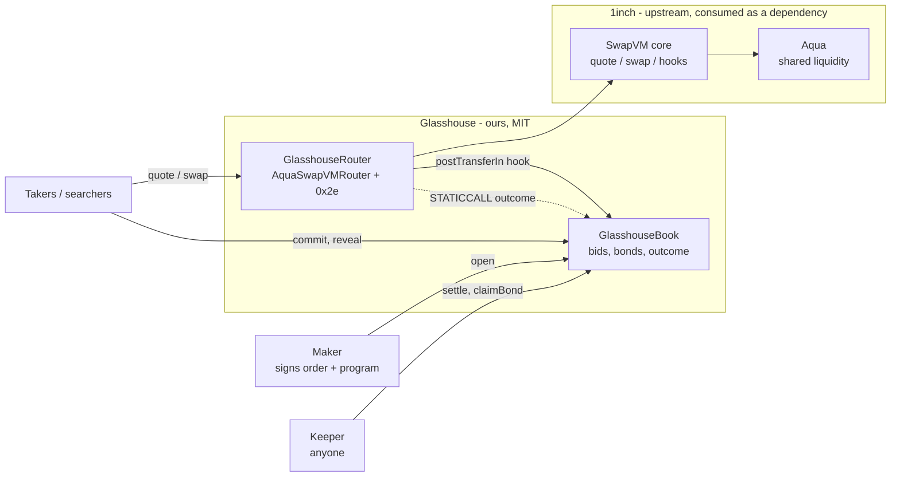
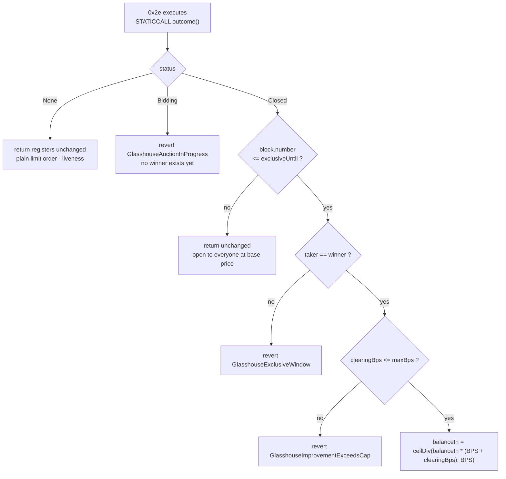
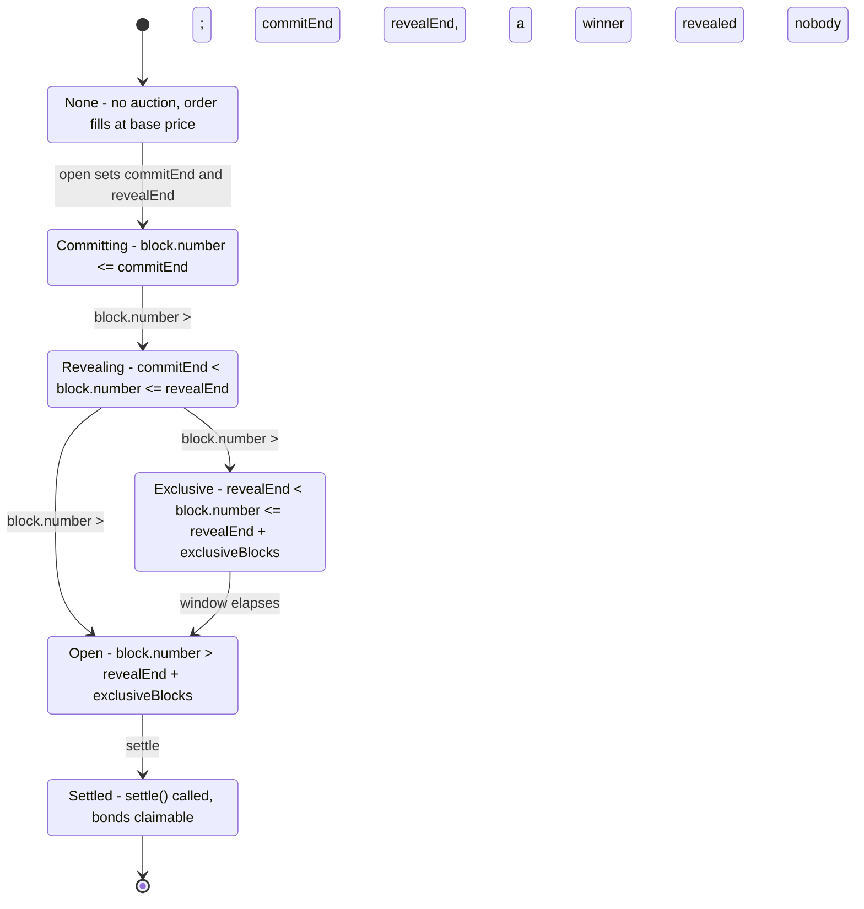

# Glasshouse - High-Level Design

**Version 0.1.0 - 2026-09-05 - Status: current as of D3.**

Audience: an engineer who knows Ethereum and DeFi but has never seen 1inch Aqua or
SwapVM. Every claim below is traceable to a file and line that was read while writing
this document; upstream citations are relative to `node_modules/@1inch/swap-vm/`.
Section 12 lists what could not be verified.

Companion documents: [`../../README.md`](../../README.md) (the argument),
[`../../ARCHITECTURE.md`](../../ARCHITECTURE.md) (the reviewed design),
[`../../run.md`](../../run.md) (research and decision log).

---

## 1. Purpose and problem statement

### 1.1 What SwapVM is, in one paragraph

SwapVM is a virtual machine for programmable token swaps. A maker signs an order whose
payload contains a **program**: a byte string of `[opcode:1][args_len:1][args:N]`
instructions. The router exposes two entry points, `quote()` and `swap()`, and both
execute that same program over four mutable registers - `balanceIn`, `balanceOut`,
`amountIn`, `amountOut` (`src/SwapVM.sol:154-159`, `src/SwapVM.sol:208-213`). A typical
program sets balances, applies pricing modifiers, and ends in a swap-curve instruction
such as `LimitSwap`, which turns the register ratio into an actual fill. Liquidity can
come from Aqua, 1inch's shared allowance layer, where tokens stay in the maker's wallet
and only virtual balances are tracked.

### 1.2 The gap

SwapVM ships instructions that decide **who may fill an order**, and they allocate that
right two ways.

**By identity - `WhitelistSequential`, opcode `0x2d`.** The args encode a ladder of
truncated takers with per-entry durations
(`src/instructions/Whitelist.sol:129-231`). The loop compares only the low 80 bits of
the taker address, and a taker who is not in the ladder does not simply lose priority:

```solidity
require(timeLeft >= duration, WhitelistSequentialTimeViolation());
```

`src/instructions/Whitelist.sol:221`. An outsider **reverts** until the entire cumulative
ladder has elapsed. Membership is hardcoded by the maker at signing time. This is a
cartel ladder written into the order.

**By clock - `DutchAuctionBalanceIn`, opcode `0x94`.** The price decays exponentially in
wall-clock time (`src/instructions/DutchAuction.sol:56-63`):

```solidity
uint256 elapsed = block.timestamp - start;
ctx.swap.balanceIn = ctx.swap.balanceIn * uint256(decay).pow(elapsed, ONE) / ONE;
```

The posted price is a **pure function of `block.timestamp`**. Every transaction in a
block shares one timestamp, so every bidder in that block faces an identical price.
Valuation cannot break the tie. Allocation therefore falls to intra-block transaction
ordering, which on any production chain is sold for priority fee. The surplus between the
highest bidder's valuation and the posted price is competed away into the builder's
pocket, not the maker's. The descending clock does not price the order; it runs a latency
auction whose proceeds leak out of the protocol.

**Neither instruction allocates by bid.** That is the gap Glasshouse fills.

### 1.3 What Glasshouse is

One new instruction, `Opcode._2e` - the free slot immediately after
`WhitelistSequential` in the *Conditions and access guards* bank
(`src/libs/OpcodeList.sol:53,67,68`; the enum's own rule at `src/libs/OpcodeList.sol:14`
is *"For new instructions take the next free `_Ix` slots of their family bank"*). The
instruction gates the fill on a **sealed-bid, second-price (Vickrey) auction with a
reserve**, run in a separate contract. The winning bid is expressed as a price
improvement in basis points applied to `balanceIn`, so ordinary settlement delivers the
surplus to the maker with no escrow and no payout path.

Because all 256 enum members already exist upstream, **no 1inch file is modified or
vendored.**

---

## 2. Goals and non-goals

### Goals

| # | Goal |
|---|---|
| G1 | Allocate taker priority by **bid**, not by identity and not by clock. |
| G2 | Route the resulting surplus to the **maker**, through ordinary SwapVM settlement. |
| G3 | Preserve `quote()` / `swap()` consistency exactly. The instruction is `view`. |
| G4 | Ship inside EIP-170 on a router derived from the deployed Aqua router. |
| G5 | Stay permissionless: exclusivity is earned by bid, bounded in blocks, and expires. |
| G6 | Keep liveness: an order whose maker never opened an auction is still fillable. |

### Non-goals

These are out of scope by decision, not by omission.

- **No zkVM proof of auction execution.** Considered as `M-1` and ruled out on timeline
  (`run.md` F-118).
- **No threshold cryptography or encrypted mempool.** Considered as `M-2`, same ruling.
  Bid secrecy comes from a plain commit-reveal, not from FHE or threshold IBE.
- **No new relay, builder, or off-chain auctioneer.** The auction is a contract; there is
  no operator to trust and none to run.
- **Not an auction-managed AMM.** Glasshouse auctions *who may take this order*, not the
  pool-manager role and not the fee. The maker-side auction axis is occupied
  (`run.md` F-102).
- **No claim to beat a Dutch auction on expected revenue.** Revenue Equivalence forbids
  that claim under its own assumptions. See §10.1.
- **No randomness.** The close is at fixed block numbers. There is no `blockhash`, no
  VRF, and no candle.
- **No collusion resistance and no censorship resistance.** Both are stated openly in
  §11 rather than papered over.

---

## 3. System context



Everything inside `glass` is ours and MIT-licensed. Everything inside `up` is consumed
from npm and never copied into the repository: Aqua and SwapVM are published under
`LicenseRef-Degensoft-*-1.1`, which is source-available rather than open source
(`node_modules/@1inch/swap-vm/src/instructions/Whitelist.sol:1`).

The intended chain is **Base mainnet**, where Aqua is deployed. See §9.

---

## 4. Component decomposition

Five source files, plus one build guard.

| File | Kind | Owns |
|---|---|---|
| `src/interfaces/IGlasshouseBook.sol` | interface + types | `AuctionStatus`, `Outcome`, and the `view` contract between the VM and the Book |
| `src/lib/GlasshouseAuctionLib.sol` | library, `internal view` | The mechanism: read the outcome, decide the branch, scale `balanceIn` |
| `src/book/GlasshouseBook.sol` | contract, stateful | Auctions, sealed bids, bonds, `outcome()`, fill recording, settlement |
| `src/instructions/GlasshouseAuction.sol` | library | Opcode identity, argument encoding and decoding, `exec` |
| `src/routers/GlasshouseRouter.sol` | contract | Opcode dispatch, the deployable router |
| `scripts/size-check.mjs` | build guard | Fails the build if any deployable contract exceeds 24,576 bytes |

### 4.1 The interface is deliberately narrow

`Outcome` carries four fields and nothing else: `status`, `winner`, `clearingBps`,
`exclusiveUntil` (`src/interfaces/IGlasshouseBook.sol:26-31`). The instruction never sees
a bid list, a bidder count, or a commitment. `outcome()` is declared `view` and documented
as required to be O(1), because it executes inside a swap and shares the taker's gas
budget (`src/interfaces/IGlasshouseBook.sol:41,46`).

### 4.2 Why the mechanism is a library, and why it is wrapped

`GlasshouseAuctionLib.applyOutcome` takes `SwapQuery` and `SwapRegisters` directly and
returns updated registers (`src/lib/GlasshouseAuctionLib.sol:56-61`). It has **no
dependency on SwapVM's `Context`**. That was a deliberate choice with three consequences:

1. **It is testable without a router.** The mechanism can be exercised against a mock
   Book with no VM around it.
2. **Its `view`-ness is visible at the type level.** The single most important property
   of the design - that the fill gate writes no state - is enforced by the compiler on one
   function, not audited across a call graph.
3. **It can be wrapped by more than one caller.** Today it is wrapped by
   `GlasshouseAuction.exec` (`src/instructions/GlasshouseAuction.sol:64-67`), which is in
   turn dispatched by two routers: the deployable `GlasshouseRouter` and the test-only
   `GlasshouseTestRouter`. `ARCHITECTURE.md` §5.3 specifies a second wrapper, a
   `GlasshouseExtruction` target that would run the same mechanism on the official 1inch
   router with no redeployment. **That second wrapper does not exist in the tree yet**
   (see §12).

### 4.3 How the opcode reaches the router

Opcode sets in swap-vm HEAD are an `if`/`else` chain inside
`_runOpcode(Context memory, uint256, bytes calldata) internal virtual`
(`src/opcodes/AquaOpcodes.sol:27-45`, sixteen arms). Extension means overriding that
function, handling the new opcode, and delegating the rest to `super` - which is exactly
what upstream's own `AquaOpcodesDebug` does. `GlasshouseOpcodes` does it in three lines
(`src/routers/GlasshouseRouter.sol:29-33`) and re-adds `WhitelistSequential`, which the
deployed Aqua opcode set omits but the headline comparison needs.

The argument encoding is 23 bytes and two fields: a 20-byte Book address at offset 0 and
a 3-byte `maxImprovementBps` at offset 20 (`src/instructions/GlasshouseAuction.sol:43-60`).
There is no `auctionId` because `ctx.query.orderHash` already binds one auction to one
order, and no `nextPC` because the register adjustment is itself the branch
(`src/instructions/GlasshouseAuction.sol:25-33`).

---

## 5. The three-phase split, and why it exists

### 5.1 The constraint

`quote()` builds its execution context with `isStaticContext: true`
(`src/SwapVM.sol:140`); `swap()` builds it with `isStaticContext: false`
(`src/SwapVM.sol:194`). Both then call `ctx.runLoop()` over the same program bytes
(`src/SwapVM.sol:171` and `src/SwapVM.sol:229`). `quote()` is documented *"Method can be
executed in a static-call"* (`src/SwapVM.sol:122`), which is how price discovery reaches
it.

The consequence is sharp: **an instruction that writes state, emits an event, or reads
anything that can change between the quote and the swap makes the two diverge.** A `LOG`
under `STATICCALL` reverts outright, so the instruction cannot even emit an event to
record its own execution.

But an auction needs a bid book, and a bid book is state.

### 5.2 The resolution

Split the mechanism into three phases that are **disjoint in block space**, and put only
the middle one inside the VM.

| Phase | Where it runs | Writes state | Block range |
|---|---|---|---|
| 1. Bidding | `GlasshouseBook`, ordinary transactions | yes | `block.number <= revealEnd` |
| 2. Fill gate | `GlasshouseAuction` instruction, inside the VM | **no** - one `STATICCALL` to `outcome()` | `block.number > revealEnd` |
| 3. Settlement | `GlasshouseBook.settle()`, a keeper transaction | yes | after the exclusive window |

Phase 1 is `open()`, `commit()` and `reveal()`. The instruction never sees these
transactions. Phase 2 does exactly one external call, and it is a `view` call
(`src/lib/GlasshouseAuctionLib.sol:62`). Phase 3 touches no SwapVM code at all.

The phase boundaries are enforced on both sides of the seam. `reveal()` requires
`block.number <= a.revealEnd` (`src/book/GlasshouseBook.sol:174`); the gate refuses to
resolve while `status == Bidding`, which is exactly `block.number <= revealEnd`
(`src/book/GlasshouseBook.sol:216-218`, `src/lib/GlasshouseAuctionLib.sol:69`).
**No block can contain both a reveal and a fill**, so the top-2 that `outcome()` reads is
frozen before any fill can observe it.

### 5.3 How the fill gets recorded

Settlement needs to know who actually filled, but the instruction cannot emit. The
answer is SwapVM's own extension point for post-settlement side effects. The maker's
order sets the `postTransferIn` hook with the Book as target; `swap()` calls it after the
taker's `tokenIn` has landed (`src/SwapVM.sol:297-302`, inside `_transferIn`), and
`quote()` never calls hooks because it has no transfer phase. The Book requires
`msg.sender == a.router` (`src/book/GlasshouseBook.sol:250`), with the router address
fixed at `open()`.

Because hooks live outside the program, writing here cannot affect quote/swap
consistency. This is precisely what the hook mechanism was built for.

`test/GlasshouseVM.t.sol:388-404` asserts the split directly: after a `quote()` the
Book's `filledBy` is still `address(0)`; after a `swap()` it is the winner.

---

## 6. Trust model and boundaries

### 6.1 What the Book can and cannot do

`GlasshouseBook` has **no owner, no upgrade path, and no admin function**. There is no
`Ownable`, no proxy, and no setter. Auction parameters - router, bond token, commit and
reveal ends, exclusive length, reserve, cap, bond size - are written once in `open()` and
never again (`src/book/GlasshouseBook.sol:108-142`; `open()` reverts with
`AlreadyOpened()` if `commitEnd != 0`, line 121).

So the answer to *"who can change what `outcome()` returns?"* is **nobody**. That is what
makes the quote/swap consistency argument airtight rather than merely plausible: after
`revealEnd`, the storage `outcome()` reads is frozen by the phase rule itself, and no
privileged party exists who could unfreeze it.

Auction squatting is closed by the key: `key = keccak256(maker, orderHash)` with
`msg.sender` as the maker (`src/book/GlasshouseBook.sol:101-103,119`), and the
instruction queries with `ctx.query.maker` (`src/lib/GlasshouseAuctionLib.sol:62`). A
stranger can open an auction under their own namespace, but no order will ever read it.

### 6.2 The program does not trust the Book

Even with no admin, the program treats `outcome()` as untrusted input. The maker signs a
`maxImprovementBps` cap into the program args, and the gate enforces it against whatever
the Book returns:

```solidity
require(o.clearingBps <= maxBps, GlasshouseImprovementExceedsCap(o.clearingBps, maxBps));
```

`src/lib/GlasshouseAuctionLib.sol:85`. Whatever the Book claims, the price cannot move
further than the maker authorised in the program they signed.
`test/GlasshouseVM.t.sol:322-335` exercises this with a Book returning a clearing price
above the cap; the swap reverts rather than overcharging the taker.

This matters because the Book address is an *argument* to the instruction, not a
constant. A maker could point the opcode at any contract implementing
`IGlasshouseBook`. The cap bounds the damage that a hostile or buggy one can do to a
taker: the taker's worst case is the maker's own declared maximum.

### 6.3 The remaining trust surfaces, named

- **The maker chooses the Book address and the auction parameters.** A maker who points
  at a hostile Book can, within the cap, always name themselves the winner. This makes
  the order useless to everyone else rather than dangerous - it is a self-inflicted
  wound, and the cap bounds the taker's exposure regardless.
- **The maker can withdraw Aqua liquidity mid-auction.** Balances shrink for `quote()`
  and `swap()` identically, so consistency holds, but a bidder can win an auction over a
  position that has since shrunk. This is the same risk any Aqua taker bears.
- **The chain's sequencer orders the last commit block.** Base has a single sequencer
  that could drop commits at `commitEnd`. No auction format fixes this.

---

## 7. Key flows

### 7.1 Full lifecycle

```mermaid
sequenceDiagram
    autonumber
    actor M as Maker
    actor B1 as Bidder A
    actor B2 as Bidder B
    participant BK as GlasshouseBook
    participant R as GlasshouseRouter
    actor K as Keeper

    Note over M,BK: Phase 1 - bidding, block.number <= revealEnd
    M->>BK: open(orderHash, router, tokenIn, windows, reserveBps, maxBps, bond)
    BK-->>BK: emit AuctionOpened
    B1->>BK: commit(keccak(bidder, bps, salt))
    B2->>BK: commit(...)
    Note over BK: commitEnd passes
    B1->>BK: reveal(400 bps, salt) + bond
    B2->>BK: reveal(250 bps, salt) + bond
    BK-->>BK: O(1) top-2 update

    Note over R,BK: Phase 2 - fill, block.number > revealEnd
    B1->>R: swap(order, amount, takerData)
    R->>BK: STATICCALL outcome(maker, orderHash)
    BK-->>R: Closed, winner=A, clearingBps=250, exclusiveUntil
    R-->>R: balanceIn *= 1.0250, then LimitSwap prices it
    R->>BK: postTransferIn hook - filledBy = A
    BK-->>BK: emit AuctionFilled

    Note over K,BK: Phase 3 - settlement, after the window
    K->>BK: settle(maker, orderHash)
    BK-->>BK: winnerForfeited = best != filledBy; emit AuctionSettled
    B2->>BK: claimBond - refunded
    B1->>BK: claimBond - refunded, it filled
    M->>BK: claimForfeit - only if the winner did not fill
```

The winner bid 400 bps and pays 250: the clearing price is
`max(reserveBps, secondBps)` (`src/book/GlasshouseBook.sol:227`). Forfeiture is decided
once in `settle()` (`src/book/GlasshouseBook.sol:270`) and bonds are then claimed
individually, pull-style, so there is no unbounded loop over bidders.

### 7.2 The `quote()` read path against the `swap()` write path

This is the diagram to read if you read only one. The two paths execute **the same
program bytes**; they differ only after `runLoop()` returns.

```mermaid
sequenceDiagram
    autonumber
    participant T as Taker
    participant R as Router
    participant P as Program - runLoop
    participant BK as GlasshouseBook
    participant TK as Tokens

    rect rgb(238, 244, 250)
    Note over T,BK: quote() - isStaticContext true, SwapVM.sol:140
    T->>R: quote(order, amount, takerData)
    R->>P: runLoop over program
    P->>P: StaticBalances sets balanceIn / balanceOut
    P->>BK: STATICCALL outcome()
    BK-->>P: Outcome
    P->>P: 0x2e scales balanceIn, or reverts
    P->>P: LimitSwap prices amountIn / amountOut
    P-->>R: amountIn, amountOut
    R-->>T: amountIn, amountOut
    Note over R,TK: no transfer phase, so no maker hook is ever called
    end

    rect rgb(240, 248, 240)
    Note over T,TK: swap() - isStaticContext false, SwapVM.sol:194
    T->>R: swap(order, amount, takerData)
    R->>P: runLoop over the SAME program
    P->>BK: STATICCALL outcome() - identical frozen storage
    BK-->>P: identical Outcome
    P-->>R: identical amountIn, amountOut
    R->>TK: _transferOut then _transferIn
    R->>BK: postTransferIn hook - SwapVM.sol:297-302
    BK-->>BK: filledBy = taker; emit AuctionFilled
    end
```

The two shaded blocks are identical above the transfer line. That identity is asserted as
a test rather than argued: `test_QuoteEqualsSwap` at `test/GlasshouseVM.t.sol:342-364`
checks that `amountIn` and `amountOut` match between the two calls **and** that the token
balances actually moved by the quoted amounts.

The maker hook fires only in the green block, and only inside `_transferIn`. That is the
whole reason the fill can be recorded at all without breaking the gate's `view`-ness.

### 7.3 The decision inside `applyOutcome`



Source: `src/lib/GlasshouseAuctionLib.sol:62-94`.

Three properties of this shape are load-bearing.

**`None` passes through.** A maker may ship a strategy and never open an auction. The
order must still be fillable as an ordinary limit order, otherwise the instruction is a
liveness hazard (`src/lib/GlasshouseAuctionLib.sol:65`;
`test/GlasshouseVM.t.sol:230-237`).

**`Bidding` reverts for everyone, including the eventual winner.** If outsiders could
fill at the base price while bids were still arriving, the auction would resolve over an
order that had already been taken (`src/lib/GlasshouseAuctionLib.sol:69`;
`test/GlasshouseVM.t.sol:242-265`).

**The exclusive window is the reason bids are worth placing.** Without it, a non-winner
fills at the unimproved base price in the same block, which is strictly cheaper than the
winner's improved price - so bidding is strictly dominated by not bidding and the auction
attracts no bidders at all (`src/lib/GlasshouseAuctionLib.sol:74-83`). `open()` refuses
`exclusiveBlocks == 0` for exactly this reason
(`src/book/GlasshouseBook.sol:122-126`).

**The surplus needs no transfer.** `LimitSwap` prices every branch off the ratio
`balanceIn / balanceOut`: exact-in is `amountOut = amountIn * balanceOut / balanceIn`,
exact-out is `amountIn = ceil(amountOut * balanceIn / balanceOut)`, and both full-fill
branches charge `balanceIn` for `balanceOut`
(`node_modules/@1inch/swap-vm/src/instructions/LimitSwap.sol:53-77`). Scaling `balanceIn`
up by `(1 + b)` therefore raises the taker's price by exactly `b` in all four branches,
and the improvement reaches the maker through ordinary settlement. No escrow, no payout
path, no reentrancy surface. It is the mirror image of `DutchAuctionBalanceIn`, which
scales the same register *down* over time. `ceilDiv` is used so that rounding favours the
maker, matching `LimitSwap`'s own convention.

This also fixes the program layout: the gate must run **after** balances are set and
**before** the swap curve. In signature mode that is
`StaticBalances -> GlasshouseAuction -> LimitSwap` (`test/GlasshouseVM.t.sol:109-115`);
in Aqua mode balances are loaded by the core before `runLoop`, so `StaticBalances` is
unnecessary.

---

## 8. Phase state machine

All boundaries are **block numbers**, fixed at `open()` and never moved. Nothing here
depends on `block.timestamp`, on `blockhash`, or on any randomness.



Mapping onto what the instruction sees (`src/book/GlasshouseBook.sol:210-230`):

| Book state | `outcome().status` | Gate behaviour |
|---|---|---|
| None | `None` | pass through, base price |
| Committing, Revealing | `Bidding` | revert for everyone |
| Exclusive | `Closed`, `winner != 0`, `block.number <= exclusiveUntil` | winner pays `max(reserve, second)`; everyone else reverts |
| Open | `Closed`, window elapsed | pass through, base price, for anyone including the winner |
| Revealing ended with no reveals | `Closed`, `winner == 0`, `exclusiveUntil = revealEnd` | pass through immediately |

`Settled` is invisible to the instruction. Settlement writes `filledBy`, `settled` and
`winnerForfeited`, and `outcome()` reads none of them
(`src/book/GlasshouseBook.sol:49-52,210-230`). This is deliberate: it means a settlement
transaction landing between a taker's quote and their swap cannot move the price.

The one input to `outcome()` that moves between blocks is `block.number` itself, and it
moves in exactly one way: crossing `exclusiveUntil` flips *outsider reverts* to *outsider
passes* and *winner pays improved* to *winner pays base*. This is time-dependent gating,
the same class as upstream's `Deadline` (`0x20`), `WhitelistSequential` (`0x2d`) and
`DutchAuction` (`0x94`), all of which change their outcome across blocks. Within a block
the branch is fixed, which is the property `quote()` and `swap()` require.

---

## 9. Deployment topology

Target chain: **Base mainnet**, chain id 8453, added to `hardhat.config.ts` on day 1
because swap-vm's own config ships `localhost` only. Base is where Aqua is actually
deployed; there is no public Aqua testnet.

### 9.1 Two routers, on purpose

| Router | Opcode set | Size | Deployed |
|---|---|---|---|
| `GlasshouseTestRouter` (`test/GlasshouseVM.t.sol:39-51`) | full `Opcodes` + `0x2e` | over EIP-170 | **never** |
| `GlasshouseRouter` (`src/routers/GlasshouseRouter.sol:47`) | `AquaOpcodes` + `0x2e` + `WhitelistSequential` | **21,108 B** | yes |

The reason there are two is not convenience. `AquaOpcodes` dispatches sixteen arms
(`node_modules/@1inch/swap-vm/src/opcodes/AquaOpcodes.sol:27-45`) and contains **neither
`LimitSwap` nor `StaticBalances` nor `DutchAuctionBalanceIn` nor `WhitelistSequential`**.
The three-way comparison that carries the whole argument - the same order under the
cartel ladder, under the Dutch clock, and under the sealed bid - therefore cannot run on
the router we ship.

It does not have to. Upstream's full `SwapVMRouter` compiles to **29,159 bytes** against
an EIP-170 limit of **24,576**, so it is undeployable - and yet swap-vm's own Solidity
tests deploy it in-test, because **the test EVM does not enforce EIP-170**.
`GlasshouseTestRouter` is built on that same full opcode set for the same reason, and
`scripts/size-check.mjs` exempts it by name alongside `SwapVMRouter` and the `*Debug`
contracts (`scripts/size-check.mjs:22`).

So: **`GlasshouseTestRouter` proves the comparison; `GlasshouseRouter` is what ships.**

### 9.2 The bytecode budget

solc reports an over-size contract as a *warning*, not an error, so without a build guard
the failure surfaces only when a deploy reverts. `npm run size` runs on every build and
exits non-zero above the limit (`scripts/size-check.mjs:15,84-88`).

Measured, by running that script against the current artifacts:

| Contract | Size | Headroom to 24,576 |
|---|---|---|
| `AquaSwapVMRouter` (upstream baseline) | 20,376 B | 4,200 B |
| **`GlasshouseRouter`** | **21,108 B** | **3,468 B** |
| `GlasshouseBook` | 5,603 B | not router-budgeted |

Our opcode **plus** re-adding `WhitelistSequential` costs **732 bytes** of the 4,200
available. `GlasshouseBook` is a separate contract and does not compete for that budget,
which is the second reason the mechanism lives in a Book rather than in the instruction.

### 9.3 Deployment plan

`GlasshouseBook` deploys first and takes no constructor arguments. `GlasshouseRouter`
takes `(aqua, weth, owner, name, version)` and passes them straight to the `SwapVM`
constructor (`src/routers/GlasshouseRouter.sol:48-54`). Signature mode needs no Aqua at
all - the router accepts `aqua = address(0)`, which is how the test suite runs
(`test/GlasshouseVM.t.sol:87`), because `useAquaInsteadOfSignature` is a MakerTraits bit
handled in the SwapVM core rather than an opcode (`src/SwapVM.sol:166,219`).

**Not yet done.** `ignition/modules/` is empty and no address has been deployed. The
roadmap places the Base deployment on Sat 06 Sep (`run.md` §9, gate G2).

---

## 10. Design decisions and their alternatives

### 10.1 Second-price, not first-price, and not a candle close

**Alternatives considered:** first-price sealed bid; a candle or randomised close.

**Chosen:** second-price (Vickrey) with a reserve, fixed close at `revealEnd`.

The obvious objection to any sealed-bid auction here is that *a Dutch auction is
strategically equivalent to a first-price sealed-bid auction*, so a first-price
instruction would be opcode `0x94` with extra steps. That equivalence is real and
unconditional, which is why the design is not first-price.

Second-price is equivalent to the **English** auction, not the Dutch, and under
independent private values truthful bidding is dominant. Practically, that means bidders
need not model each other's latency or valuations - which matters, because a new
mechanism sees thin bidder sets, and bid-shading in a thin first-price auction is noisy
and depresses maker revenue.

The sharper objection is Revenue Equivalence: under IPV with risk-neutral symmetric
bidders, all four standard formats yield the same expected seller revenue. **Glasshouse
does not claim to beat that.** The claim is narrower and provable from source: RET
assumes the object goes to the highest-value bidder, and in `DutchAuctionBalanceIn` it
does not, because the price is quantised to `block.timestamp`
(`src/instructions/DutchAuction.sol:60-62`) and allocation therefore falls to intra-block
ordering. Glasshouse changes **the allocation rule** (by bid, not by latency) and **the
surplus recipient** (the maker, not the builder). That is the entire claim.

A candle or randomised close was in the v1 design and was dropped. A randomised close
defends *open ascending* auctions against last-second sniping; in a sealed commit-reveal
nobody can react to anyone's bid, so there is nothing to snipe. It bought nothing and
cost weak on-chain randomness, a 256-block liveness bound from `blockhash`, and - worst -
a genuine quote/swap divergence when a taker's transaction crossed that bound and
`blockhash` silently returned zero, moving the close and potentially the winner.

### 10.2 Sealed bids, for shill resistance rather than anti-sniping

**Alternative:** open (public) bids, which are simpler and were the designated cut if the
schedule slipped.

Commit-reveal is kept for a reason that survives cross-examination: in an *open*
second-price auction, the maker or a confederate can watch the top bid and insert a shill
just beneath it, extracting nearly first-price and destroying the truthfulness that is
second-price's whole justification. Commit-reveal means nobody, the maker included, sees
a bid before commits close (`src/book/GlasshouseBook.sol:144-147`).

Note what this does *not* claim. Bids are hidden only until reveal, and only from parties
who cannot compute the preimage. This is a commitment scheme, not encryption, and it does
not survive a bidder who reveals to a colluder off-chain.

### 10.3 The exclusive window

**Alternative:** let non-winners fall through to the base price at any time. This was the
v1 design, and it read well - "permissionless by construction", the deliberate inverse of
`WhitelistSequential`'s revert.

It was economically self-defeating. If an outsider can fill at the base price in the same
block in which the winner would fill at the improved price, then the winner pays *more*
for a fill anyone else gets *cheaper*. Bidding is strictly dominated by not bidding, and
the auction has no bidders.

The fix is an exclusive window of `exclusiveBlocks` after `revealEnd` during which
outsiders revert, after which the order opens to everyone at base price
(`src/lib/GlasshouseAuctionLib.sol:72-94`). This is the same gate `WhitelistSequential`
applies today; the differences are that membership is **earned by bid** rather than
hardcoded by the maker, and that it **expires**.

Note the configuration hazard that came with it: `exclusiveBlocks == 0` reproduces the
original flaw exactly, so `open()` rejects it (`src/book/GlasshouseBook.sol:122-126`).
Design review caught the mechanism hole; only tests caught the parameter setting that
recreated it (`run.md` F-134).

### 10.4 Price improvement in bps on `balanceIn`

**Alternatives:** an explicit payment from winner to maker; escrow of the bid amount;
routing the surplus through upstream's `FeeProtocol` surplus-fee hook.

Expressing the bid as a basis-point improvement on `balanceIn` means ordinary settlement
delivers the surplus. `LimitSwap` derives price from the register ratio in all four of
its branches (`node_modules/@1inch/swap-vm/src/instructions/LimitSwap.sol:53-77`), so a
single multiplicative adjustment before it is enough. Settlement then pays the improved
`amountIn` to the maker through the normal path - `AQUA.push` in Aqua mode, or a
`transferFrom` to the maker's receiver in signature mode (`src/SwapVM.sol:260-292`).

The consequence worth stating: **there is no escrow, no payout function, and no
reentrancy surface** anywhere in the surplus path. It also keeps the instruction tiny,
which is what fits it inside the 4,200-byte budget.

### 10.5 Vickrey with one bidder, and with none

**Alternative:** require at least two reveals.

With exactly one reveal there is no second price. The maker's `reserveBps` serves as the
implicit second bid: `clearingBps = max(reserveBps, secondBps)`, and `secondBps` is zero
when only one bidder revealed (`src/book/GlasshouseBook.sol:227`). That is textbook
Vickrey-with-reserve and it leaves the clearing price well defined for any bidder count.
With zero reveals there is no winner, no window, and the order opens immediately
(`src/book/GlasshouseBook.sol:219-222`).

### 10.6 O(1) top-2 instead of a bidder scan

`outcome()` runs inside a swap and spends the taker's gas, so it cannot loop over
bidders. The top two bids are maintained incrementally at reveal time
(`src/book/GlasshouseBook.sol:194-203`). Reveal *order* is irrelevant to the result -
max is order-independent, and ties break on commit index, which was fixed before anyone
knew they were tying, so no latency race is reintroduced.

This is also where a real defect lived. A maker may set `reserveBps = 0`, making a
`bps == 0` bid valid; on an empty book such a bid satisfied neither `bps > bestBps`
(0 > 0) nor `bps > secondBps`, so the only revealed bidder silently failed to become the
winner. The `a.best == address(0)` seeding arm fixes it
(`src/book/GlasshouseBook.sol:194`).

### 10.7 Bonds denominated in `tokenIn`

**Alternative:** native ETH bonds, simpler to handle.

The bidder must hold `tokenIn` to fill at all, forfeiture goes to the maker in the token
the maker was owed, and the sizing rule `bond >= maxBps * notional / BPS` makes both
winner-no-show and reveal-withholding unprofitable
(`src/book/GlasshouseBook.sol:293-297`). Bonds are claimed pull-style after `settle()`
rather than pushed, so there is no loop over bidders and no failed-transfer griefing.

---

## 11. Risks and open questions

### 11.1 Mechanism risks

| Risk | Status |
|---|---|
| **Reveal withholding.** With bids 100 > 90 > 80 bps, the second bidder can decline to reveal so the winner pays 80. | Standard Vickrey weakness, not solved. Bounded by requiring the forfeited bond to exceed the gain from withholding. Forfeits go to the maker, the only party harmed. |
| **Bidder rings.** Collusion among bidders depresses the clearing price. | Not solved and not claimed to be. The bond bounds it; it does not remove it. |
| **Sequencer censorship of the last commit block.** | Not solvable by auction format. Base runs a single sequencer. Stated, not mitigated. |
| **Maker withdraws Aqua liquidity mid-auction.** | Documented bidder risk. Quote and swap shrink identically, so consistency holds. |
| **`quote()` reverts for outsiders during the window**, which generic UIs may read as a broken order. | Identical to `WhitelistSequential`'s behaviour today. Documented; the explanation page has to show the window. |

### 11.2 Engineering risks

| Risk | Status |
|---|---|
| **Bytecode budget.** 3,468 B of headroom remains. Any further opcode addition eats it. | Guarded on every build by `scripts/size-check.mjs`. Do not add `DutchAuctionBalance*`, `OraclePriceAdjuster`, or the Debug set to the deployed router. |
| **Silent argument-offset bugs.** `InstructionArgs.at(shift)` does no bounds checking; a wrong offset reads zeros or neighbouring bytes rather than reverting. | Reduced to two fields at offsets 0 and 20. A build/parse round-trip test exists at `test/GlasshouseArgs.t.sol`. |
| **The Book address is an instruction argument, not a constant.** | Bounded by the signed `maxImprovementBps` cap (§6.2), not eliminated. |
| **Not deployed.** No mainnet address, no Ignition module, no on-chain auction has run. | Scheduled for Sat 06 Sep. Until then every claim here rests on local tests. |

### 11.3 Open questions

1. **Invariant coverage.** The 1D reference harness is upstream's
   `test/invariants/DutchAuctionLimitSwapInvariants.t.sol`, to be cloned with the Dutch
   instruction swapped for ours. Which of `CoreInvariants`' skip flags
   (`skipAdditivity`, `skipMonotonicity`, `skipSpotPrice`, `skipSymmetry`) are genuinely
   needed is **not yet determined by running it**. Only `skipAdditivity` looks certain,
   the flag being labelled for non-AMM orders.
2. **Gas cost of the gate.** The `STATICCALL` plus decode of a four-field struct has not
   been measured against the taker's budget on a real fill.
3. **Partial fills across the window boundary.** `LimitSwap` supports partial fills. A
   winner who partially fills inside the window leaves a remainder that opens at base
   price afterwards. This is believed to be correct and desirable, but it is not covered
   by a test.
4. **Second execution of the gate in one program.** Both executions read the same frozen
   storage and so return the same result, which is why the hazard upstream's
   `Extruction` documents for *stateful* targets does not apply. Not asserted by a test.
5. **Whether the exclusive window should be denominated in blocks or in time.** Blocks
   were chosen so the phase rule and the VM gate agree on one clock. On a chain with
   variable block times this makes the window's wall-clock length variable.

---

## 12. Claims in this document that are not verified

Stated explicitly rather than smoothed over.

- **`GlasshouseTestRouter`'s own bytecode size is not measured.** The verified 29,159 B
  figure is upstream's full-opcode `SwapVMRouter`; `GlasshouseTestRouter` is built on the
  same `Opcodes` set plus our arm, so it is necessarily larger and likewise over
  EIP-170, but no artifact for it appears in `artifacts/` and `scripts/size-check.mjs`
  did not report one. §9.1 says "over EIP-170" rather than giving a number.
- **The 57-passing-tests figure comes from `run.md`'s change log** (2026-09-05 entry),
  not from a test run performed while writing this document. The tree contains three
  test files: `GlasshouseArgs.t.sol`, `GlasshouseBook.t.sol`, `GlasshouseVM.t.sol`.
- **`ComparisonTest.t.sol` does not exist in the tree.** The three-way comparison against
  `WhitelistSequential` and `DutchAuctionBalanceIn` is designed, and
  `GlasshouseTestRouter` exists to host it, but it has not been written. §9.1 describes
  what the test router is *for*, not a test that has run.
- **`GlasshouseExtruction` (Path B) does not exist in the tree.** `ARCHITECTURE.md` §5.3
  specifies it; `src/` contains no `extruction/` directory. The "wrapped twice" property
  of `GlasshouseAuctionLib` is currently a property of its *interface* (it takes no
  `Context`), not of two shipped wrappers.
- **No Base mainnet deployment exists.** `ignition/modules/` is empty.
- **`AquaSwapVMRouter` at 20,376 B was not re-measured here.** The size script reported
  only Glasshouse contracts against the current artifacts; the baseline figure is carried
  from `run.md` F-108 and `README.md`.
- **The claim that priority fee captures the Dutch-auction surplus is an economic
  argument, not a measurement.** What is verified from source is that the posted price is
  a pure function of `block.timestamp` and that allocation therefore cannot depend on
  valuation. That the residual is competed into priority fee is inference from how
  block-space markets work, and it is stated as such.
