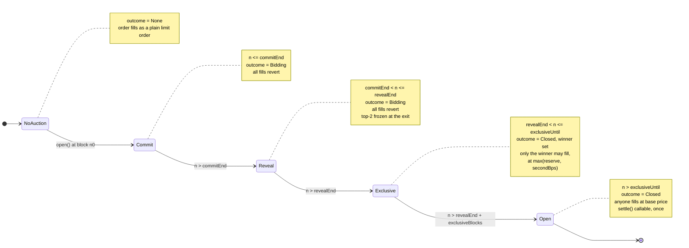

**Version 0.5.0 - trimmed 2026-09-07.**

> Sections that restated the source line by line have been removed - the per-function
> reference, the branch walkthrough, the builder, and the test map. What is kept is what a
> reader cannot get by opening the file: the storage packing, the displacement rule and its
> invariant, the wire format, the catalogues, the bytecode budget, and the defects this
> reading found. Removed sections are in git history.

# Glasshouse Low-Level Design

Companion to `docs/design/HLD.md`. The HLD covers system context, trust model and
high-level flows. This document is the level below: storage layout, function-by-function
behaviour, the exact algorithms, the wire format, and the budgets.

## 0. Scope, conventions and provenance

Citations are `path/File.sol:line` against the working tree at the time of writing.
Upstream 1inch source is cited as `node_modules/@1inch/swap-vm/src/...` and is read-only;
no 1inch file is modified or vendored.

Two labels are used throughout:

- **verified** means measured or executed in this repo (a test that runs, a `solc`
  output, a size report).
- **computed** means derived by reading the source and applying a documented rule
  (for example Solidity's struct packing rule) without a machine confirming it.

Where both were available, both are given. Numbers taken from `run.md` rather than
measured here are labelled as such.

Snapshot note: the working tree moved while this document was being written.
`test/Comparison.t.sol` and `test/helpers/GlasshouseTestRouter.sol` landed mid-pass, and
`test/GlasshouseVM.t.sol` was refactored to import the test router from `helpers/`
instead of declaring it inline. Test counts below record both states. All `src/` files
were unchanged across the pass.

Contents:

1. Contract inventory
2. `GlasshouseBook`
3. Phase state machine
4. `GlasshouseAuctionLib.applyOutcome`
5. Instruction encoding
6. Opcode slot and router extension
7. The read-only constraint
8. Event catalogue
9. Error catalogue
10. Bytecode budget
11. Test coverage map
12. Defects and gaps found while writing this document

---

## 1. Contract inventory

Sizes are deployed (runtime) bytecode, measured by `npm run size` on 2026-09-05 with
solc 0.8.30, `viaIR: true`, `optimizer.runs: 700`, `evmVersion: prague` (settings read
from `artifacts/build-info/*.json`).

| File | Unit | Kind | Deployed | Runtime size |
|---|---|---|---|---|
| `src/book/GlasshouseBook.sol` | `GlasshouseBook` | contract | yes, once per chain | 5,603 B (verified) |
| `src/lib/GlasshouseAuctionLib.sol` | `GlasshouseAuctionLib` | library, all `internal` | no, inlined into callers | 57 B stub (verified) |
| `src/interfaces/IGlasshouseBook.sol` | `IGlasshouseBook`, `Outcome`, `AuctionStatus` | interface and types | n/a | n/a |
| `src/instructions/GlasshouseAuction.sol` | `GlasshouseAuction` | library, all `internal` | no, inlined | 57 B stub (verified) |
| `src/routers/GlasshouseRouter.sol` | `GlasshouseOpcodes` | abstract opcode bank | no, inherited | 57 B stub (verified) |
| `src/routers/GlasshouseRouter.sol` | `GlasshouseRouter` | contract | yes, the shipping router | 21,108 B (verified) |
| `test/helpers/GlasshouseTestRouter.sol` | `GlasshouseFullOpcodes`, `GlasshouseTestRouter` | test-only router | never | 29,159 B per `run.md` F-108 and the file's own header comment; not built in `artifacts/` |

The 57 B figures are the empty-library deployment stubs solc emits for libraries whose
functions are all `internal`; nothing calls them at runtime. `scripts/size-check.mjs`
lists them because it walks every artifact with a non-empty `deployedBytecode`.

`GlasshouseBook` is the only stateful contract in the system
(`src/book/GlasshouseBook.sol:14`). It has no owner, no upgrade path and no admin
function; every auction parameter is fixed at `open()` and never written again
(`src/book/GlasshouseBook.sol:17-19`, and see §2.3).

---

## 2. `GlasshouseBook`

### 2.1 Storage layout

Two mappings, both keyed by the composite key of §2.2
(`src/book/GlasshouseBook.sol:62-63`):

```solidity
mapping(bytes32 key => Auction) private _auctions;                        // slot 0
mapping(bytes32 key => mapping(address bidder => Bid)) private _bids;     // slot 1
```

#### 2.1.1 `Auction` (`src/book/GlasshouseBook.sol:32-53`)

The packing below was **computed** from the declared types by applying Solidity's
sequential packing rule (a field occupies the current slot if it fits in the bytes
remaining, otherwise starts a new one), and then **verified** by re-running solc 0.8.30
over the same standard-JSON input with `outputSelection: storageLayout` added. The
computed and verified layouts agree exactly.

| Slot | Offset | Bytes | Field | Type | Meaning |
|---|---|---|---|---|---|
| 0 | 0 | 20 | `router` | `address` | The router whose `postTransferIn` hook is trusted to record a fill. |
| 0 | 20 | 12 | *(padding)* | | Wasted. See §12, G-1. |
| 1 | 0 | 20 | `tokenIn` | `address` | Bond denomination. |
| 1 | 20 | 5 | `commitEnd` | `uint40` | Last block on which `commit()` is accepted. Also the "opened" sentinel: nonzero means the auction exists. |
| 1 | 25 | 5 | `revealEnd` | `uint40` | Last block on which `reveal()` is accepted. Also the freeze point for `outcome()`. |
| 1 | 30 | 2 | *(padding)* | | `exclusiveBlocks` needs 5, only 2 remain. |
| 2 | 0 | 5 | `exclusiveBlocks` | `uint40` | Length of the winner's exclusive window, in blocks after `revealEnd`. |
| 2 | 5 | 3 | `reserveBps` | `uint24` | The maker's implicit second bid. Reveals below this are rejected. |
| 2 | 8 | 3 | `maxBps` | `uint24` | Reveals above this are rejected. Distinct from the program's own cap (§4). |
| 2 | 11 | 16 | `bond` | `uint128` | Per-bidder bond, denominated in `tokenIn`, escrowed at reveal. |
| 2 | 27 | 5 | *(padding)* | | `best` needs 20, only 5 remain. |
| 3 | 0 | 20 | `best` | `address` | Highest revealed bidder under the order of §2.4, or zero. |
| 3 | 20 | 3 | `bestBps` | `uint24` | Its bid. |
| 3 | 23 | 5 | `bestCommitIdx` | `uint40` | Its commit index, used only as the tie-break key. |
| 3 | 28 | 4 | *(padding)* | | |
| 4 | 0 | 20 | `second` | `address` | Runner-up address. Written but never read. See §12, G-2. |
| 4 | 20 | 3 | `secondBps` | `uint24` | The clearing input. This is the field that matters. |
| 4 | 23 | 5 | `commitCount` | `uint40` | Monotonic counter; the next `commitIdx` to hand out. |
| 4 | 28 | 4 | *(padding)* | | |
| 5 | 0 | 20 | `filledBy` | `address` | First taker recorded by the maker hook. Zero until a fill lands. |
| 5 | 20 | 1 | `settled` | `bool` | Set by `settle()`. |
| 5 | 21 | 1 | `winnerForfeited` | `bool` | Decided by `settle()`. |
| 5 | 22 | 10 | *(padding)* | | |

Six slots. The comment blocks in the struct partition the fields by writer, and that
partition is the safety argument in miniature:

- Slots 0 to 2 are written once, by `open()` (`src/book/GlasshouseBook.sol:132-139`).
- The `best`/`second` group in slots 3 and 4 is written only by `reveal()`, and only
  while `block.number <= revealEnd` (`src/book/GlasshouseBook.sol:194-203`).
- Slot 5 is written by the maker hook and `settle()`, and is never read by `outcome()`
  (`src/book/GlasshouseBook.sol:210-230` reads slots 1 through 4 only).

Therefore everything `outcome()` reads is frozen the moment `block.number > revealEnd`,
which is the first block in which a fill can occur. That is the whole quote/swap
consistency argument, expressed as a storage partition.

#### 2.1.2 `Bid` (`src/book/GlasshouseBook.sol:55-60`)

Computed and verified the same way. Two slots.

| Slot | Offset | Bytes | Field | Type | Meaning |
|---|---|---|---|---|---|
| 0 | 0 | 32 | `commitment` | `bytes32` | `keccak256(abi.encodePacked(bidder, bps, salt))`. Nonzero means committed. |
| 1 | 0 | 5 | `commitIdx` | `uint40` | Position in commit order, assigned at `commit()`. |
| 1 | 5 | 1 | `revealed` | `bool` | Set by `reveal()`. Gates `claimBond`. |
| 1 | 6 | 1 | `bondClaimed` | `bool` | Set by `claimBond()` or, for the forfeiting winner, by `claimForfeit()`. |
| 1 | 7 | 25 | *(padding)* | | |

Cost note: a first-time `commit()` writes two cold slots (commitment plus `commitIdx`)
and updates `commitCount` in `Auction` slot 4. A `reveal()` writes `Bid` slot 1 again
plus one or two `Auction` slots, and moves the bond.

### 2.2 Keying, and why maker namespacing matters

```solidity
function key(address maker, bytes32 orderHash) public pure returns (bytes32) {
    return keccak256(abi.encodePacked(maker, orderHash));
}
```
(`src/book/GlasshouseBook.sol:101-103`)

`abi.encodePacked(address, bytes32)` is 52 bytes with no length prefix. Both arguments
are fixed-width, so the usual `encodePacked` ambiguity (two dynamic types whose
concatenation is reachable two ways) does not apply; the encoding is injective.

`open()` derives the key from `msg.sender`, not from a parameter
(`src/book/GlasshouseBook.sol:119`). The instruction resolves the key from
`ctx.query.maker` and `ctx.query.orderHash`, both of which the VM fills from the signed
order (`src/lib/GlasshouseAuctionLib.sol:62`, against
`node_modules/@1inch/swap-vm/src/SwapVM.sol:143-150`). The two must therefore agree, and
`msg.sender` is the only writer of the maker half.

The consequence is that auction squatting is structurally impossible rather than
defended against. If Mallory calls `open(orderHash_of_Alice, ...)`, she creates an
auction at `key(Mallory, orderHash)`. Alice's order resolves `outcome(Alice, orderHash)`,
a different key, which is still `AuctionStatus.None`, so her order remains a plain limit
order and Mallory's auction is unreachable from any program. Pinned by
`test/GlasshouseBook.t.sol:98-107`, which asserts the two keys differ and that both
`open()` calls succeed.

There is no `auctionId` in the instruction args for the same reason: `orderHash` already
binds exactly one auction to exactly one order, for free
(`src/instructions/GlasshouseAuction.sol:30-33`).

### 2.4 The O(1) top-2 maintenance algorithm

```solidity
if (a.best == address(0) || bps > a.bestBps || (bps == a.bestBps && b.commitIdx < a.bestCommitIdx)) {
    a.second = a.best;
    a.secondBps = a.bestBps;
    a.best = msg.sender;
    a.bestBps = bps;
    a.bestCommitIdx = b.commitIdx;
} else if (bps > a.secondBps) {
    a.second = msg.sender;
    a.secondBps = bps;
}
```
(`src/book/GlasshouseBook.sol:194-203`)

#### The displacement rule

Define a strict total order on revealed bids. For bids `x = (bps_x, idx_x)` and
`y = (bps_y, idx_y)` with distinct commit indices,

```
x ≻ y   iff   bps_x > bps_y   or   (bps_x == bps_y and idx_x < idx_y)
```

Higher bid first; on equal bids the earlier commit first. Commit indices are unique per
auction (`commitCount` is strictly increasing and one commit per address is enforced), so
`≻` is a strict total order and `argmax` is unique.

The displacement condition on line 194 is exactly `x ≻ best`, with the extra
`a.best == address(0)` disjunct discussed below.

#### The invariant

Let `R` be the set of bids revealed so far. After every `reveal()` returns:

- **I1.** `(a.best, a.bestBps, a.bestCommitIdx)` is the `≻`-maximum of `R`, or the zero
  triple if `R` is empty.
- **I2.** `a.secondBps = max{ bps_x : x ∈ R \ {argmax R} }`, or 0 if that set is empty.

Both are pure set functions of `R`. Nothing in either statement mentions the order in
which `R` was assembled, which is exactly the property being claimed.

#### Why it holds

By induction on reveals. Base case: `R = ∅`, everything zero, both hold.

Inductive step, adding `x` to `R`:

- If `x ≻ argmax R`, then `argmax(R ∪ {x}) = x`, so I1 is restored by the assignment
  block. For I2: the new runner-up value is
  `max{bps_y : y ∈ (R ∪ {x}) \ {x}} = max{bps_y : y ∈ R}`, and the old `bestBps` is
  precisely that maximum by I1 (the `≻`-max also maximises `bps`, since `≻` orders on
  `bps` first). The code sets `a.secondBps = a.bestBps` before overwriting, which is that
  value.
- Otherwise `argmax(R ∪ {x})` is unchanged, so I1 holds trivially. For I2 the excluded
  element is unchanged, so the new value is `max(old secondBps, bps_x)`, which is what
  `else if (bps > a.secondBps) a.secondBps = bps;` computes. The comparison is strict, but
  a non-strict one would assign the same number.

#### Why the result is independent of reveal order

I1 and I2 characterise `best` and `secondBps` as functions of the *set* `R`. Since every
reveal either occurs or does not, independent of when, the final `R` is the same set
whatever order the reveals arrive in, so `best` and `secondBps` are the same. Ties resolve
to the earliest commit because `≻` breaks ties on `idx`, and `idx` was fixed during the
commit phase, before any bid was visible. There is no latency race to win: revealing
earlier does not help, revealing later does not help.

Verified three ways in `test/GlasshouseBook.t.sol`:

- Same tie, both reveal orders, same winner and same clearing price (lines 396-426).
- Three-way tie revealed in reverse commit order, earliest still wins (lines 428-443).
- `testFuzz_TopTwo_MatchesReferenceScan` (lines 451-492): 2 to 8 bidders, bids seeded from
  a fuzzed seed, revealed in a seed-dependent **rotation** of commit order, checked against
  a naive two-pass reference scan for both winner and clearing price. 256 runs per `forge`
  invocation.

One caveat, and it is the reason I1/I2 are stated in terms of `secondBps` and not
`second`: the **address** in `a.second` is *not* order-independent. With bids
`5(idx0), 3(idx1), 3(idx2)`, revealing in commit order leaves `a.second = idx1`, while
revealing `idx2` before `idx1` leaves `a.second = idx2`, because the `>` on line 200 is
strict and does not consult `commitIdx`. Nothing reads `a.second`, so this is harmless
today. It is recorded as G-2 in §12 because the field is exposed by `auctions()` and an
indexer could reasonably mistake it for a canonical runner-up.

#### The `a.best == address(0)` seeding arm, and the bug it fixes

Without the first disjunct, the condition is `bps > a.bestBps || (bps == a.bestBps && idx < bestCommitIdx)`.

Consider a maker who sets `reserveBps = 0`. Then `bps = 0` is a valid bid: it passes
`bps >= a.reserveBps` on line 175. Suppose exactly one bidder reveals, with `bps = 0`, on
an empty book. Then `a.bestBps == 0` and `a.bestCommitIdx == 0`, so:

- `bps > a.bestBps` is `0 > 0`, false.
- `bps == a.bestBps` is true, but `b.commitIdx < a.bestCommitIdx` is `0 < 0`, false.
- The `else if` is `bps > a.secondBps`, that is `0 > 0`, false.

The bidder is dropped entirely. `a.best` stays zero, `outcome()` takes the third arm and
reports no winner at all. The bidder's bond is refundable, so they lose nothing, but the
maker loses a fill it had earned and the auction silently produces nothing. Logged as the
first half of `run.md` F-134, found by writing the test and not by three rounds of design
review.

The `a.best == address(0)` disjunct fixes it by seeding: on an empty book the first
reveal always becomes `best`, whatever its `bps`. The three assignments to `second`,
`secondBps` and the displacement of the old best are no-ops in that case, because the old
best is the zero triple.

The arm has to come **first** in the disjunction. Placed later it would still be
evaluated (`||` short-circuits left to right, so a later position only matters if an
earlier disjunct is true, which by the analysis above it is not), but leading with it
makes the empty-book case an explicit, readable branch rather than an emergent one.

Pinned by `test/GlasshouseBook.t.sol:378-392`, which opens with `reserveBps = 0`, reveals
a single `bps = 0` bid, and asserts both that the bidder wins and that the clearing price
is 0.

### 2.5 The clearing rule

```solidity
uint24 clearingBps = a.secondBps > a.reserveBps ? a.secondBps : a.reserveBps;
```
(`src/book/GlasshouseBook.sol:227`, repeated identically at line 272 for the settlement
event)

That is `max(reserveBps, secondHighestBps)`: second price with a reserve. Well defined at
every bidder count, which is the point, because textbook Vickrey is ill-posed with one
bidder.

| Revealed bidders | `best` | `secondBps` | `clearingBps` | Reached where |
|---|---|---|---|---|
| 0 | `address(0)` | 0 | not computed; `outcome()` returns 0 on the third arm | `GlasshouseBook.sol:219-222` |
| 1 | the bidder | 0 (I2, empty set) | `max(reserve, 0) = reserveBps` | line 227 |
| n ≥ 2 | `≻`-max | the second-highest bid | `secondBps`, since every revealed bid is `≥ reserveBps` | line 227 |

The n ≥ 2 row deserves a precise statement. `reveal()` rejects any `bps < reserveBps`
(line 175), so every element of `R` satisfies `bps ≥ reserveBps`, so `secondBps ≥ reserveBps`
whenever `|R| ≥ 2`. The `max` is therefore *never binding* for two or more bidders: it
collapses to `secondBps`. The reserve floor does real work only in the single-bidder case,
where it is the maker's implicit second bid.

This makes one test name slightly stronger than what it tests:
`test_Clearing_SecondBelowReserveFloorsAtReserve` (`test/GlasshouseBook.t.sol:347-359`)
sets the second bid to exactly `RESERVE_BPS`, because a second bid strictly below the
reserve is unreachable. The assertion is correct; the name describes a state the contract
makes impossible. Noted, not a defect.

Zero-bidder liveness matters as much as the price: a committed bidder who never reveals
must not be able to lock the order. With no reveals there is no winner, no exclusive
window, and the order opens at base price the instant the reveal phase ends
(`test/GlasshouseBook.t.sol:363-374`).

### 2.6 Bond lifecycle

```
commit()          nothing moves
reveal()          bond: bidder -> Book          (escrow)
settle()          decide winnerForfeited        (no transfer)
claimBond()       bond: Book -> bidder          (pull)
claimForfeit()    bond: Book -> maker           (pull, winner's bond only)
```

**Escrow** happens at reveal, conditional on `bond > 0`
(`src/book/GlasshouseBook.sol:184-185`). A zero bond skips the transfer entirely, so an
auction with `bond == 0` never touches `tokenIn` and does not require it to be a real
token. `test/GlasshouseVM.t.sol` uses `bond = 0` for exactly that reason.

**Forfeiture** is decided once, at settle: `a.best != address(0) && a.filledBy != a.best`
(`src/book/GlasshouseBook.sol:270`). Read directly: a winner who bought exclusivity and
then did not fill denied the maker a fill it had earned.

**Claims are pull, not push.** `settle()` transfers nothing; it only writes two bools.
Each bidder then calls `claimBond()` for themselves, and the maker calls `claimForfeit()`.
Three reasons this is the right shape here, in order of weight:

1. **No unbounded loop.** A push design would have `settle()` iterate over all revealed
   bidders. Bidder count is unbounded (anyone may commit), so `settle()` would have an
   unbounded gas cost and could be made uncallable by committing enough addresses. The
   auction would then never settle and every bond would be stuck.
2. **No failing transfer can block settlement.** `tokenIn` is maker-chosen, so it may be
   a token that reverts on transfer to a blocklisted address or returns false. Under push,
   one such bidder bricks the whole settlement. Under pull, that bidder's own claim fails
   and nobody else is affected.
3. **Reentrancy surface is per-claim and already closed.** Both claim functions set
   `bondClaimed` before the external call, so a hostile token gains nothing by
   reentering.

Conservation: exactly one claim path exists per revealed bidder, gated by the single
`bondClaimed` flag, and the winner's flag is shared between `claimBond` and
`claimForfeit`, so the winner's bond can leave the contract exactly once and in exactly
one direction. `test/GlasshouseBook.t.sol:637-651` asserts the escrow balance is
2 * `BOND` after two reveals and exactly 0 after the forfeit claim plus the loser's claim.

The interaction with §12 G-3 and G-4 is the important caveat: forfeiture is only as
meaningful as `filledBy` is trustworthy, and non-reveal is currently free.

---

## 3. Phase state machine

All boundaries are on `block.number` and all are fixed at `open()`. Write
`C = commitEnd`, `R = revealEnd = C + revealBlocks`, `X = revealEnd + exclusiveBlocks`.
`open()` guarantees `commitBlocks > 0`, `revealBlocks > 0`, `exclusiveBlocks > 0`, so
`open_block < C < R < X` and every interval below is non-empty.

| Block range | `outcome().status` | `commit` | `reveal` | fill via the instruction | `settle` |
|---|---|---|---|---|---|
| before `open()` | `None` | reverts `NotOpened` | reverts `NotOpened` | no auction; behaves as a plain limit order | reverts `NotOpened` |
| `open_block ≤ n ≤ C` | `Bidding` | **allowed** | reverts `RevealNotOpen` | reverts `GlasshouseAuctionInProgress` | reverts `WindowNotElapsed` |
| `C < n ≤ R` | `Bidding` | reverts `CommitClosed` | **allowed** | reverts `GlasshouseAuctionInProgress` | reverts `WindowNotElapsed` |
| `R < n ≤ X` | `Closed` | reverts `CommitClosed` | reverts `RevealClosed` | **winner only**, at `max(reserve, secondBps)`; others revert `GlasshouseExclusiveWindow`. If there was no winner, open to all at base price. | reverts `WindowNotElapsed` |
| `n > X` | `Closed` | reverts `CommitClosed` | reverts `RevealClosed` | **open to all**, at base price | **allowed**, once |

Disjointness, read off the guards rather than asserted:

- commit requires `n ≤ C` (`GlasshouseBook.sol:152`); reveal requires `n > C`
  (line 173). No `n` satisfies both.
- reveal requires `n ≤ R` (line 174); `outcome()` returns `Bidding` for `n ≤ R`
  (line 216) and the instruction refuses to fill on `Bidding`
  (`GlasshouseAuctionLib.sol:69`). No `n` admits both a reveal and a fill.
- the exclusive window is `R < n ≤ X` (`GlasshouseAuctionLib.sol:72`); settlement
  requires `n > X` (`GlasshouseBook.sol:265`). No `n` admits both.

The second bullet is the safety property the whole design rests on. Because no block can
contain both a reveal and a fill, the top-2 that `outcome()` reads is frozen strictly
before any fill can observe it, and therefore `outcome()` is constant across the entire
fill phase for a given auction. `test/GlasshouseBook.t.sol:284-300` walks the exact
boundary blocks `C`, `C+1`, `R`, `R+1` and asserts the status at each.
`test/GlasshouseVM.t.sol:334-349` then shows the *price* is stable across the first and
last block of the exclusive window.



If nobody revealed, the `Exclusive` state is entered but is empty of privilege:
`outcome()` returns `winner = address(0)` and `exclusiveUntil = revealEnd`, so the
window test in §4 is false from the first fill block and the order is open to everyone
immediately.

---

## 4. `GlasshouseAuctionLib.applyOutcome`

`src/lib/GlasshouseAuctionLib.sol:56-95`. `internal view`. Takes the read-only
`SwapQuery`, the mutable `SwapRegisters`, the book address and the maker's signed cap;
returns updated registers. Only `balanceIn` is ever written.

### 4.2 The surplus mechanism

`LimitSwap.exec` prices every branch off the ratio `balanceIn / balanceOut`
(`node_modules/@1inch/swap-vm/src/instructions/LimitSwap.sol:53-77`). All four branches,
with `bIn`, `bOut` the registers:

| Branch | Condition | Result | Price paid, in per out |
|---|---|---|---|
| exact-in, capped | `isExactIn`, `amountIn >= bIn` | `amountIn = bIn`, `amountOut = bOut` | `bIn / bOut` |
| exact-in, partial | `isExactIn`, `amountIn < bIn` | `amountOut = amountIn * bOut / bIn` | `bIn / bOut` |
| exact-out, capped | `!isExactIn`, `amountOut >= bOut` | `amountIn = bIn`, `amountOut = bOut` | `bIn / bOut` |
| exact-out, partial | `!isExactIn`, `amountOut < bOut` | `amountIn = ceilDiv(amountOut * bIn, bOut)` | `bIn / bOut` |

The price is the same expression in all four. Therefore replacing `bIn` by `bIn * (1 + b)`
multiplies the taker's price by exactly `(1 + b)` in all four, which is to say it raises
it by `b`. Nothing else in the registers changes; `balanceOut` is untouched.

Two second-order notes, both benign:

- Scaling `bIn` up can move a fill across the capped/partial boundary (the condition
  `amountIn >= bIn` is evaluated against the *scaled* `bIn`). It does not matter: both
  branches on each side price at `bIn / bOut`, so the ratio is continuous across the
  boundary.
- `Math.ceilDiv` on line 88 rounds the scaled `balanceIn` **up**, so the taker pays at
  least `(1 + b)` times the base price. That matches `LimitSwap`'s own convention, which
  floors `amountOut` and ceils `amountIn`, both toward the maker. The two roundings
  compose in the same direction; total error is bounded by one unit of the last place at
  each step.

The improvement reaches the maker through ordinary SwapVM settlement. There is no escrow,
no payout path, and no new transfer, so there is no new reentrancy surface. This is the
mirror image of `DutchAuctionBalanceIn`, which scales `balanceIn` *down* over time
(`node_modules/@1inch/swap-vm/src/instructions/DutchAuction.sol:62`): the clock concedes
to the taker, the auction concedes to the maker, and both use the same register.

Numerically pinned by `test/GlasshouseVM.t.sol:185-190`, which recomputes
`(BALANCE_B * (10_000 + bps) + 9_999) / 10_000` independently and feeds it through the
`LimitSwap` formula, and asserts equality with the router's own `quote()` at line 245.

### 4.3 Required instruction ordering

```
Aqua mode:       [ GlasshouseAuction ] -> [ LimitSwap ]
Signature mode:  [ StaticBalances ] -> [ GlasshouseAuction ] -> [ LimitSwap ]
```
(`src/lib/GlasshouseAuctionLib.sol:45-47`; the signature-mode program is built at
`test/GlasshouseVM.t.sol:_program`)

In Aqua mode no balance instruction is needed because `SwapVM` fills the registers from
Aqua before `runLoop()` starts
(`node_modules/@1inch/swap-vm/src/SwapVM.sol:168` for `quote`, `:222` for `swap`).

Both halves of the ordering constraint fail **silently**, which is why they are stated as
security-critical rather than as style:

- **Before the balances.** `StaticBalances.exec` assigns `ctx.swap.balanceIn` and
  `ctx.swap.balanceOut` outright
  (`node_modules/@1inch/swap-vm/src/instructions/Balances.sol:46-54`). Running Glasshouse
  first means the scaled value is overwritten by the unscaled one. No revert. The
  exclusive-window gate still excludes outsiders and the winner still fills, so the
  auction looks like it worked, but the maker receives the base price and the entire
  surplus is destroyed.
- **After the swap curve.** `LimitSwap.exec` computes `amountIn`/`amountOut` from
  `balanceIn` and then nothing downstream re-reads `balanceIn`. Scaling it afterwards
  changes a register nobody looks at. No revert, same outcome: the winner pays base price
  and the auction extracted nothing.

In both misorderings the observable symptom is a price, not an error, so ordering cannot
be checked by "does it revert". It has to be checked by "does the winner's quote differ
from the base quote", which is what `test/GlasshouseVM.t.sol:235-247` asserts
(`assertLt(out, _basePriceOut())` alongside the exact expected value).

The instruction has no `nextPC` argument, unlike the whitelist opcodes. Those jump
because they grant a shortcut past subsequent gates; Glasshouse adjusts a register and
either reverts or falls through, so the adjustment *is* the branch and a jump target
would be dead weight in both bytecode and args
(`src/instructions/GlasshouseAuction.sol:25-28`).

---

## 5. Instruction encoding

### 5.1 Wire format

```
byte  0        1        2 .. 21              22 .. 24
    +--------+--------+--------------------+------------------------+
    | 0x2e   | 0x17   | address book (20)  | uint24 maxImprove (3)  |
    +--------+--------+--------------------+------------------------+
      opcode   argsLen  <---------------- args, 23 bytes ---------->
                                     total 25 bytes
```

The 2-byte header `[opcode:1][argsLength:1]` is the VM's, not ours:
`InstructionBuilder.sizeOf()` returns 2
(`node_modules/@1inch/swap-vm/src/libs/InstructionBuilder.sol:17-19`) and `runLoop`
decodes it by shifting the opcode out of the top byte and masking the length out of the
next (`node_modules/@1inch/swap-vm/src/libs/VM.sol:129-136`).

`GlasshouseAuction.sizeOf` returns `InstructionBuilder.sizeOf() + 20 + 3 = 25`
(`src/instructions/GlasshouseAuction.sol:43-45`). Verified by
`test/GlasshouseArgs.t.sol:36-40` (`sizeOf == InstructionBuilder.sizeOf() + 23`, and
`InstructionBuilder.sizeOf() == 2`) and `:49-54` (`build(...).length == 25`,
`ins[0] == 0x2e`, `ins[1] == 23`).

23 is comfortably under the 255-byte cap `patchLength` enforces
(`node_modules/@1inch/swap-vm/src/libs/InstructionBuilder.sol:25-29`).

### 5.3 `parse`, and why the encoding is tested first

```solidity
function parse(bytes calldata args) internal pure returns (address book, uint24 maxImprovementBps) {
    book = args.at(0).asAddress();
    maxImprovementBps = args.at(20).asU24();
}
```
(`src/instructions/GlasshouseAuction.sol:57-60`)

`args` here is the slice *after* the header; `runLoop` hands each instruction its own
args slice. The test harness reproduces that by slicing `instruction[2:]`
(`test/GlasshouseArgs.t.sol:15-17`).

`InstructionArgs.at` is a bare `calldataload`:

```solidity
function at(bytes calldata calls, uint256 shift) internal pure returns (bytes32 res) {
    assembly ("memory-safe") { res := calldataload(add(calls.offset, shift)) }
}
```
(`node_modules/@1inch/swap-vm/src/libs/InstructionArgs.sol:13-17`)

There is no bounds check, and the library says so explicitly in its own header comment
("The library does not implement out-of-bounds read validations",
`InstructionArgs.sol:9-10`). Three consequences:

1. A wrong `shift` does not revert. It returns the neighbouring bytes, or zeros past the
   end of calldata. A mis-parsed `book` address would silently point somewhere else; a
   mis-parsed `maxImprovementBps` would silently cap the price wrong. Either way the
   failure surfaces as a mispriced swap, not as an error, and could sit undetected
   indefinitely.
2. Even the *correct* parse reads out of the slice. `at(20)` loads 32 bytes starting at
   byte 20 of a 23-byte slice, so 29 of those bytes belong to whatever follows in
   calldata, usually the next instruction. `asU24` takes only the top 3 bytes
   (`InstructionArgs.sol`, `asU24` casts through `bytes3`), so the surplus is discarded.
   This is normal for the library, but it means "it returned the right value" is a
   statement about the cast width as much as about the offset.
3. `build` and `parse` are two independent statements of the same layout. Nothing in the
   type system ties them together.

Hence `test/GlasshouseArgs.t.sol` is, by its own header, the first test written
(lines 20-26). Its coverage is aimed squarely at offset errors:

- exact round trip on a realistic address and `maxBps = 500` (lines 56-64);
- a 256-run fuzz over both fields (lines 67-71);
- **all-ones in both fields** (lines 75-83): `address(type(uint160).max)` and
  `type(uint24).max`, so any offset slip moves a `0xff` into the other field and both
  assertions fail;
- **mixed extremes** (lines 86-94): all-ones address with zero `maxBps`, then zero
  address with all-ones `maxBps`, catching a slip in either direction that all-ones alone
  would mask.

---

## 6. Opcode slot and router extension

### 6.1 The slot

```solidity
Opcode constant opcode = Opcode._2e;
```
(`src/instructions/GlasshouseAuction.sol:41`)

`OpcodeList.sol` banks the opcode space by instruction family and instructs new
instructions to take the next free `_Ix` slot of their bank
(`node_modules/@1inch/swap-vm/src/libs/OpcodeList.sol:13-14`). Bank `0x20-0x3f` is
"Conditions & access guards: taker/time validation, whitelists, conditional jumps"
(line 53). Within it, `WhitelistCoequal` is `0x2c`, `WhitelistSequential` is `0x2d`
(lines 66-67), and `_2e` is the next free slot (line 68).

Glasshouse is a taker gate, so it belongs in that bank, and `0x2e` places it immediately
after the cartel ladder it is the alternative to. Pinned by
`test/GlasshouseArgs.t.sol:42-47`, which asserts both `GlasshouseAuction.opcode.asU8() == 0x2e`
and `uint8(Opcode.WhitelistSequential) == 0x2d`, so a future upstream renumbering breaks
the test rather than the semantics.

All 256 enum members already exist upstream as named or `_Ix` placeholders, so taking
`_2e` modifies no 1inch file. Nothing is vendored, and the 1inch package stays a
dependency. This matters for licensing (`run.md` D-004 constraint 4: swap-vm is
source-available, not open source) as well as for the track rule that official
Aqua/SwapVM contracts must be used.

## 7. The read-only constraint

### 7.1 Why the instruction must be `view`

`SwapVM.quote()` builds its `Context` with `isStaticContext: true`
(`node_modules/@1inch/swap-vm/src/SwapVM.sol:140`) and `SwapVM.swap()` with
`isStaticContext: false` (`:194`). Both then run `ctx.runLoop()` over **the same program
bytes** from the same signed order. If any instruction in that program behaved
differently between the two, the quote would stop predicting the swap, and every
downstream guarantee (the taker's slippage check, the maker's cap, the comparison the
whole project rests on) would go with it.

Some upstream instructions branch on the flag deliberately (`Balances.sol:121`,
`Decay.sol:76`, `Invalidators.sol:70` and `:156` all skip a state write when static).
Glasshouse takes the stronger position: it never branches on `isStaticContext` at all,
because it never writes. Both `GlasshouseAuction.exec` and
`GlasshouseAuctionLib.applyOutcome` are declared `internal view`
(`src/instructions/GlasshouseAuction.sol:64`, `src/lib/GlasshouseAuctionLib.sol:61`), and
`IGlasshouseBook.outcome` is `external view` (`src/interfaces/IGlasshouseBook.sol:46`),
so the cross-contract call compiles to `STATICCALL`. The instruction is therefore
identical under both flags by construction rather than by inspection.

Demonstrated, not argued, by `test/GlasshouseVM.t.sol:308-330`: same order, same taker,
same block, `quote()` then `swap()`, asserting equal `amountIn` and `amountOut`, and
additionally that the taker's realised token balance deltas match the quote (so the quote
was not merely self-consistent with itself).

### 7.2 Why the instruction cannot emit, and what replaces logging

Two independent reasons, and it is worth separating them because the repo's shorthand
("LOG reverts under STATICCALL") is only the second:

1. **Compile time.** A `view` function cannot contain `LOG*`. solc rejects an `emit` in a
   `view` function outright. This is the binding constraint on
   `applyOutcome` and `exec` as written, and it holds regardless of how the router is
   called.
2. **Run time.** `LOG*` reverts inside a `STATICCALL` frame. This is what forecloses the
   escape hatch of making the instruction non-`view` and emitting only when
   `!isStaticContext`: the Book's `outcome()` is reached through a `STATICCALL` in both
   paths, and any off-chain quoter calling `quote()` through `eth_call` or an on-chain
   caller using `STATICCALL` would revert on the log.

To be precise about the second point: `SwapVM.quote()` is itself an `external`
non-`view` function that merely sets a flag, so a direct `CALL` to `quote()` is not
literally inside a static frame. The static frame that always exists is the one around
`IGlasshouseBook.outcome`. The practical effect is the same, but the guarantee that
carries the design is (1), the compile-time one.

Consequence: **all Glasshouse events come from the Book, none from the instruction.**
Fills are recorded through 1inch's own maker-hook mechanism instead:
`IMakerHooks.postTransferIn` (`node_modules/@1inch/swap-vm/src/interfaces/IMakerHooks.sol:45`),
enabled by MakerTraits **bit 251**
(`node_modules/@1inch/swap-vm/src/libs/MakerTraits.sol:38`,
`HAS_POST_TRANSFER_IN_HOOK_BIT_FLAG = 1 << 251`), with `postTransferInTarget` set to the
Book.

`swap()` calls maker hooks after `tokenIn` lands; `quote()` never does, because it has no
transfer phase at all. Hooks execute **outside** the program, so writing from one cannot
affect quote/swap consistency. This is precisely what 1inch built hooks for
(`src/book/GlasshouseBook.sol:233-235`).

Pinned end to end by `test/GlasshouseVM.t.sol:354-370`: with `hasPostTransferInHook: true`
and `postTransferInTarget: address(book)`, `filledBy` is zero before, still zero after a
`quote()`, and equal to the winner after a `swap()`.

---

## 8. Event catalogue

All seven events are declared at `src/book/GlasshouseBook.sol:65-82`. `maker` and
`orderHash` are indexed on every one, so a subgraph can filter an auction's whole history
with two topics and derive the internal key as `keccak256(abi.encodePacked(maker, orderHash))`
off-chain.

| Event | Indexed | Unindexed | Emitted at | What an indexer keys on |
|---|---|---|---|---|
| `AuctionOpened` | `maker`, `orderHash` | `router`, `tokenIn`, `commitEnd`, `revealEnd`, `exclusiveBlocks`, `reserveBps`, `maxBps`, `bond` | `open()`, line 141 | Creates the `Auction` entity. Carries every immutable parameter, so no follow-up read is needed. |
| `BidCommitted` | `maker`, `orderHash`, `bidder` | `commitIdx` | `commit()`, line 161 | Creates the `Bid` entity; `commitIdx` is the tie-break key. |
| `BidRevealed` | `maker`, `orderHash`, `bidder` | `bps`, `bond` | `reveal()`, line 205 | Updates the `Bid` to revealed. The full set of these plus `reserveBps` is sufficient to recompute winner and clearing price independently. |
| `AuctionFilled` | `maker`, `orderHash`, `taker` | `amountIn`, `amountOut` | `postTransferIn()`, line 254, first fill only | The fill record. Note: emitted at most once per auction. |
| `AuctionSettled` | `maker`, `orderHash` | `winner`, `clearingBps`, `winnerForfeited` | `settle()`, line 273 | Closes the auction entity. Only place `clearingBps` is emitted. |
| `BondClaimed` | `maker`, `orderHash`, `bidder` | `amount` | `claimBond()`, line 290 | Marks a bond returned. |
| `ForfeitClaimed` | `maker`, `orderHash` | `amount` | `claimForfeit()`, line 311 | Marks a bond seized. |

Three arguments is the EVM's cap on indexed non-anonymous event topics, and
`BidCommitted`, `BidRevealed`, `BondClaimed` and `AuctionFilled` all use it fully.

### What an indexer would need and does not have

- **`clearingBps` is not emitted at fill time.** The only event carrying it is
  `AuctionSettled`, which is emitted by a permissionless keeper call that may never
  happen. Between the fill and the settle, and forever if nobody settles, a subgraph
  cannot read the realised improvement from logs alone. It is recoverable by replaying
  every `BidRevealed` for the auction and applying `max(reserveBps, secondHighest)`, but
  that makes the headline number a derived quantity rather than an emitted one.
- **`AuctionSettled.winner` is not indexed.** A query for "auctions this address won"
  must instead join `AuctionSettled` against `BidRevealed` by `(maker, orderHash)`, or
  index winners in the mapping. Cheap to fix now, a resync to fix later.
- **`ForfeitClaimed` does not name the bidder who forfeited.** Bidder reputation ("this
  address has forfeited three times") requires joining back through `AuctionSettled` for
  the same `(maker, orderHash)`. `AuctionSettled` does carry the winner, so the join
  closes, but it is a second hop that an indexed `bidder` field would remove.
- **Surplus per fill is not computable from logs.** `AuctionFilled` carries `amountIn`
  and `amountOut`, but the *base* price lives in the order's program bytes
  (`StaticBalances` args, or Aqua's balances at fill time), which never appear in a log.
  So "improvement captured, in token terms" needs the order's program, not just the
  Glasshouse event stream.
- **`AuctionOpened` does not index `router` or `tokenIn`,** so log-level filtering by
  router or bond token is not possible; it has to be done after decoding.

None of these are correctness bugs, and `run.md` D-004 constraint 5 ("design events on
day 1, retrofitting means redeploy plus full resync") makes them worth deciding now
rather than after deployment.

---

## 9. Error catalogue

### 9.1 `GlasshouseBook` (`src/book/GlasshouseBook.sol:84-99`)

| Error | Raised at | Condition |
|---|---|---|
| `AlreadyOpened()` | 121 | `open()` on a `(maker, orderHash)` whose `commitEnd != 0`. |
| `NotOpened()` | 151, 172, 263 | `commit()`, `reveal()` or `settle()` on an auction that was never opened. |
| `BadWindow()` | 126, 127 | `open()` with any of `commitBlocks`, `revealBlocks`, `exclusiveBlocks` zero, or `reserveBps > maxBps`, or `maxBps >= 10_000`. |
| `CommitClosed()` | 152 | `commit()` at `block.number > commitEnd`. |
| `RevealNotOpen()` | 173 | `reveal()` at `block.number <= commitEnd`. |
| `RevealClosed()` | 174 | `reveal()` at `block.number > revealEnd`. |
| `AlreadyCommitted()` | 155 | Second `commit()` from the same bidder on the same auction. |
| `NoCommitment()` | 178 | `reveal()` from an address with no stored commitment. |
| `AlreadyRevealed()` | 179 | Second `reveal()` from the same bidder. |
| `BadReveal()` | 180 | `keccak256(abi.encodePacked(msg.sender, bps, salt))` does not match the stored commitment. Covers a wrong salt, a wrong bps, and a commitment copied from another bidder. |
| `BidOutOfRange(uint24 bps, uint24 reserveBps, uint24 maxBps)` | 175 | `bps < reserveBps` or `bps > maxBps`. The only error carrying data from the Book. |
| `NotRouter()` | 250 | `postTransferIn` from anything other than the auction's configured `router`, including from any address when no auction exists. |
| `NotSettled()` | 280, 301 | `claimBond()` or `claimForfeit()` before `settle()`. |
| `AlreadySettled()` | 264 | Second `settle()`. |
| `WindowNotElapsed()` | 265 | `settle()` at `block.number <= revealEnd + exclusiveBlocks`. |
| `NothingToClaim()` | 283, 284, 302, 305 | Four distinct conditions share one selector: (283) claimant never revealed, or already claimed; (284) claimant is the forfeiting winner; (302) `claimForfeit` when the winner did not forfeit; (305) `claimForfeit` when the winner's bond was already moved. |

`BadWindow()` is likewise shared across four distinct misconfigurations. Neither sharing
is a correctness problem, but both make a revert less diagnostic than it could be, and
`NothingToClaim` in particular is returned to two different callers for four different
reasons.

Not in the catalogue but reachable: `Panic(0x11)` from the checked `uint40` additions in
`open()` (lines 129-130), `outcome()` (line 229) and `settle()` (line 265) on absurd
window configurations, and whatever `SafeERC20` bubbles up from a failing bond transfer
(lines 185, 288, 309).

### 9.2 `GlasshouseAuctionLib` (`src/lib/GlasshouseAuctionLib.sol:19-24`)

| Error | Raised at | Condition |
|---|---|---|
| `GlasshouseAuctionInProgress()` | 69 | `outcome().status == Bidding`. Any fill attempt while bids can still arrive. |
| `GlasshouseExclusiveWindow(address winner, uint256 until)` | 84 | Inside the window and `query.taker != winner`. Carries the winner and the last block of the window so the caller can retry later. |
| `GlasshouseImprovementExceedsCap(uint256 clearingBps, uint256 maxBps)` | 85 | The Book reported a clearing price above the cap in the maker's signed program. |

The third is the defence against a malicious or buggy Book, and it is the only place the
program disbelieves `outcome()`.

Both selectors with arguments are asserted against exact expected values in
`test/GlasshouseVM.t.sol:249-262` and `:288-301`, so a change to either error's shape
breaks a test.

---

## 10. Bytecode budget

EIP-170 caps deployed runtime bytecode at **24,576 bytes**. Measured with
`npm run size` on 2026-09-05:

| Contract | Size | Source | Headroom |
|---|---|---|---|
| `AquaSwapVMRouter` (upstream baseline) | 20,376 B | `run.md` F-108, not built in this repo | 4,200 B |
| **`GlasshouseRouter`** | **21,108 B** | verified, `npm run size` | **3,468 B** |
| `GlasshouseBook` | 5,603 B | verified | 18,973 B |
| `SwapVMRouter` (full `Opcodes`) | 29,159 B | `run.md` F-108 | **over by 4,583 B** |

`21,108 - 20,376 = 732 B`. That is the total cost of the Glasshouse opcode **plus** the
re-added `WhitelistSequential` arm, against a projection of 1,400 to 2,100 B
(`run.md` F-131, extrapolated from `AquaSwapVMRouterDebug - AquaSwapVMRouter = 3,429 B`
for seven Debug instructions). The projection was pessimistic by roughly a factor of two;
the two additions came in well under budget, leaving 3,468 B free.

Provenance caveat: the 20,376 and 29,159 figures come from `run.md` F-108, which measured
them against the upstream repo. Neither router is compiled in this project, so
`size-check.mjs` printed no "Reference routers" section on the run above, and the 732 B
delta is a subtraction across two different builds rather than two rows of one report.
The two builds use the same solc version and settings, so the comparison is sound, but it
is not a single-report measurement.

**Why `SwapVMRouter` is undeployable.** It carries the entire `Opcodes` set. At 29,159 B
it is 4,583 B over the limit, so `CREATE` reverts. There is no configuration of
optimiser settings in the budget that closes a 19 percent overshoot. That is the reason
`GlasshouseRouter` extends `AquaSwapVMRouter` and not `SwapVMRouter`
(`src/routers/GlasshouseRouter.sol:39-43`, `run.md` D-004 constraint 1). The full-opcode
router remains useful for **testing only**, because the test EVM does not enforce EIP-170
(`run.md` F-125), which is what makes the three-way comparison in
`test/helpers/GlasshouseTestRouter.sol` possible at all.

**Why `scripts/size-check.mjs` exists.** solc reports an over-limit contract as a
*warning*, not an error (`scripts/size-check.mjs:4-8`). A build that produces an
undeployable router therefore exits 0, and the failure surfaces only when a deploy
reverts on-chain, after gas is spent and usually under time pressure. The script walks
`artifacts/`, measures `deployedBytecode` for every contract, and exits 1 on any
deployable contract over 24,576 B (lines 80-84). Test-only contracts are exempted by name
via `TEST_ONLY = [/Debug$/, /^GlasshouseTestRouter$/, /^SwapVMRouter$/]` (line 21), and are
labelled `TEST-ONLY (over, expected)` rather than silently skipped, so an exemption is
visible in the output rather than invisible in the config.

`npm run size` runs `hardhat compile` first, so the check cannot pass against stale
artifacts.

---

## 12. Defects and gaps found while writing this document

Ordered by consequence. None of these were introduced by this document; they are
observations from reading the source against the tests.

**G-3. Bond forfeiture depends on the maker wiring a hook the Book cannot verify.**
`winnerForfeited` is `a.best != address(0) && a.filledBy != a.best`
(`src/book/GlasshouseBook.sol:270`), and `filledBy` is written only by
`postTransferIn` (line 253), which only runs if the maker's **signed order** sets
MakerTraits bit 251 with `postTransferInTarget == address(book)`, and only if
`a.router` is the router that actually executed the fill. The Book validates none of
that: `open()` performs no zero-address or sanity check on `router`
(`src/book/GlasshouseBook.sol:132`), and it never sees the order's MakerTraits at all.
So a maker who sets `router` to any address that never calls the hook, or who simply
omits the hook from the signed order, guarantees `filledBy == address(0)` forever. Every
winner then forfeits at settlement even after filling honestly, and the maker collects
the bond via `claimForfeit`. With `bond > 0` this is a bond-theft vector, not merely a
misconfiguration. Bidders can check the order's traits off-chain before committing, but
nothing on-chain requires them to and nothing on-chain stops the maker. Untested (§11).

**G-4. Non-reveal is free, so the bond does not bound the behaviour the code claims it
bounds.** The bond is escrowed at `reveal()` (`src/book/GlasshouseBook.sol:184-185`), not
at `commit()`. A bidder who commits and never reveals therefore risks nothing at all.
The NatSpec on `claimForfeit` states that sizing `bond >= maxBps * notional / BPS` "makes
both winner-no-show **and reveal-withholding** unprofitable"
(`src/book/GlasshouseBook.sol:295-296`). The winner-no-show half is supported by the code;
the reveal-withholding half is not, because there is no stake to lose. This matters
mechanically, not just documentarily: reveals are public as they land, so a bidder can
watch the reveal window and decide whether to reveal based on what others have revealed.
A runner-up who withholds drops `secondBps` and lowers the winner's price to the reserve,
at zero cost. That is exactly the bidder-ring behaviour the same comment says the bond
bounds. Fixing it means escrowing at commit rather than at reveal, which is the standard
commit-reveal deposit shape. Reported as a documentation/mechanism disagreement rather
than a code bug, since the code does what it does consistently.

**G-2. `Auction.second` is reveal-order dependent and is never read.** With equal
runner-up bids, `a.second` records whichever tied bidder revealed first, because the
comparison on `src/book/GlasshouseBook.sol:200` is a strict `>` on `bps` with no
`commitIdx` tie-break. `a.secondBps`, which is the only field that affects pricing, is
order-independent (§2.4). Nothing in the contract reads `a.second`, so there is no
correctness impact today, but the field is exposed through `auctions()` and an indexer
could reasonably treat it as the canonical runner-up. Either apply the same tie-break as
`best`, or drop the field and save a storage write per displacing reveal.

**G-5. One auction per `(maker, orderHash)`, forever.** `open()` requires
`a.commitEnd == 0` (`src/book/GlasshouseBook.sol:121`) and nothing ever resets it. In
SwapVM, `orderHash` is a per-maker *position or strategy* identifier
(`node_modules/@1inch/swap-vm/src/libs/VM.sol:29`), and an Aqua position is long-lived and
refillable. So a maker can auction a given position exactly once in the contract's
lifetime; a second auction on the same position requires a new order hash, which means a
new signed order. Whether that is a limitation or the intended scope is a design question
the HLD should answer, but the LLD-level fact is that it is enforced permanently and by
accident of the sentinel rather than by an explicit rule.

**G-1. `Auction` wastes a storage slot.** Slot 0 holds only `router` and leaves 12 bytes
unused, because `tokenIn` (20 bytes) cannot follow it (§2.1.1, verified against solc's
`storageLayout`). Reordering to put the two 5-byte block numbers next to `router`
(`router, commitEnd, revealEnd` fills 30 of 32) and pairing `tokenIn` with the three small
fields (`tokenIn, exclusiveBlocks, reserveBps, maxBps` fills 31 of 32) would fit the
struct into 5 slots instead of 6, saving one cold `SSTORE` per `open()` and one `SLOAD`
on some paths. `outcome()` currently touches slots 1 through 4; a repack could plausibly
reduce that, which is the path that shares the taker's gas budget. Not urgent, and any
change invalidates a deployed Book.

**G-6. Two shared error selectors, and one arithmetic panic path.** `BadWindow()` covers
four distinct misconfigurations (`src/book/GlasshouseBook.sol:126-127`) and
`NothingToClaim()` covers four distinct claim failures across two functions (lines 283,
284, 302, 305), so a revert does not identify what went wrong. Separately, the checked
`uint40` additions at lines 129-130, 229 and 265 raise `Panic(0x11)` rather than
`BadWindow()` for absurd window lengths; the `outcome()` case (line 229) is the notable
one, since a panic there propagates out of a `view` call and reverts the taker's swap. All
three require the maker to configure windows near `2**40` blocks, so this is a
diagnosability issue rather than an exploit.

**Two claim/code disagreements worth recording, neither a bug:**

- The repo's shorthand "the instruction cannot emit because LOG reverts under STATICCALL"
  is true but is not the binding constraint. The binding constraint is that `applyOutcome`
  and `exec` are declared `view`, which makes an `emit` a compile error regardless of the
  call frame. `SwapVM.quote()` is itself a non-`view` external function; the static frame
  that always exists is the one around `IGlasshouseBook.outcome` (§7.2).
- `test_Clearing_SecondBelowReserveFloorsAtReserve`
  (`test/GlasshouseBook.t.sol:347`) tests a second bid equal to the reserve, not below it,
  because `reveal()` rejects sub-reserve bids so "second below reserve" is unreachable
  with two or more bidders. The assertion is right; the name describes an impossible
  state (§2.5).

---

## Appendix A. Verification record

| Claim | How it was established |
|---|---|
| `Auction` and `Bid` storage layouts | Computed from the packing rule, then verified by re-running solc 0.8.30 over the project's own standard-JSON input with `storageLayout` requested. Computed and verified agree exactly. |
| `GlasshouseRouter` 21,108 B, `GlasshouseBook` 5,603 B | Verified, `npm run size` on 2026-09-05. |
| `AquaSwapVMRouter` 20,376 B, `SwapVMRouter` 29,159 B | Not verified here. Taken from `run.md` F-108; neither contract is compiled in this project. |
| 67 tests pass | Verified, `npm test` on 2026-09-05. |
| Opcode `0x2e`, `WhitelistSequential` `0x2d` | Verified by `test/GlasshouseArgs.t.sol:42-47` and read directly at `node_modules/@1inch/swap-vm/src/libs/OpcodeList.sol:67-68`. |
| 25-byte instruction, header 2 bytes | Verified by `test/GlasshouseArgs.t.sol:36-54`. |
| MakerTraits bit 251 is the postTransferIn flag | Read at `node_modules/@1inch/swap-vm/src/libs/MakerTraits.sol:38`. |
| `quote()` sets `isStaticContext = true`, `swap()` false | Read at `node_modules/@1inch/swap-vm/src/SwapVM.sol:140` and `:194`. |
| `LimitSwap` prices all four branches off `balanceIn / balanceOut` | Read at `node_modules/@1inch/swap-vm/src/instructions/LimitSwap.sol:53-77`. |
| `AquaOpcodes` has 16 dispatch arms, no `LimitSwap`, no `StaticBalances`, no whitelist, no Dutch | Read at `node_modules/@1inch/swap-vm/src/opcodes/AquaOpcodes.sol:27-45`. |
| `InstructionArgs.at` is an unchecked `calldataload` | Read at `node_modules/@1inch/swap-vm/src/libs/InstructionArgs.sol:9-17`. |
